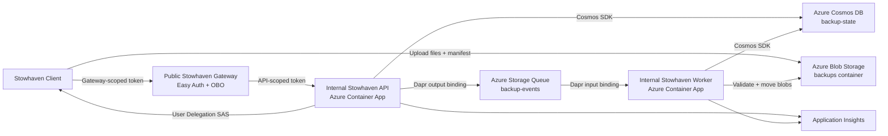

# Stowhaven

[](https://github.com/FlorisDeVries/stowhaven/actions/workflows/deploy.yml)


> Private backups, safely tucked away.

Stowhaven is a low-cost, cloud-native backup platform built with **.NET 10**, **Azure Container Apps**, **Dapr**, **Azure Blob Storage**, and **Azure Cosmos DB for NoSQL**.

The API issues short-lived, least-privilege SAS URLs so backup clients can upload encrypted or plaintext backup data directly to Azure Blob Storage. The service keeps the control plane small and cheap while the bulk data path goes straight from client to storage.

## What this repository contains

- **Stowhaven Gateway**: public Container App that authenticates client traffic, performs the Entra ID on-behalf-of exchange, and proxies API and Swagger requests to internal services.
- **Stowhaven API**: internal HTTP API for device registration, backup run orchestration, SAS issuance, commit status, restore metadata, health checks, and operational endpoints.
- **Stowhaven Worker**: internal background Container App that consumes Azure Storage Queue messages through a Dapr input binding and finalizes staged backup runs.
- **Stowhaven Client**: .NET console/Windows-service-friendly client that scans configured targets, applies `.backupignore` rules, uploads changed files, and commits runs.
- **Shared libraries**: contracts, core services, health checks, logging, feature flags, and security helpers.
- **Infrastructure-as-Code**: Bicep deployment for Blob and Queue Storage, Cosmos DB containers, Key Vault, Container Apps, monitoring, Dapr components, and managed-identity RBAC.
- **CI/CD**: GitHub Actions workflow using Azure OIDC and a multi-phase deployment.

## Key features

- **Direct-to-Blob uploads** using directory-scoped User Delegation SAS.
- **No storage account keys** in clients or application settings.
- **Incremental backup flow**: upload only new or changed files.
- **Asynchronous commit pipeline** via Dapr Azure Storage Queue bindings and a dedicated worker.
- **Provider-backed state repository** using SQLite locally and Azure Cosmos DB for NoSQL in production.
- **Optional zero-knowledge client-side encryption** through the backup client.
- **Blob lifecycle management** for low-cost long-term retention.
- **Managed identity-first Azure access** for Blob/Queue Storage, Cosmos DB, and Key Vault.
- **Production observability** through Application Insights and Log Analytics.
- **Local development stack** with Docker Compose, Dapr sidecars, Azurite, SQLite, and the Aspire dashboard.

## Architecture at a glance



The gateway authenticates public traffic and forwards it to the internal API with an API-scoped token. The API handles authorization, SAS issuance, and queuing commit work. The worker performs the heavier commit processing: validating staged blobs, moving active versions into place, retiring older versions, and updating authoritative state in Cosmos DB.

## Backup flow

1. The client authenticates with Microsoft Entra ID.
2. The client registers or resolves its device record through the API.
3. The client starts a backup run for a device.
4. The API creates run state and returns a short-lived SAS for `staging/{deviceId}/{runId}/`.
5. The client scans configured targets and uploads only changed/new files directly to Blob Storage.
6. The client uploads `run-manifest.json` under `runs/{deviceId}/{runId}/`.
7. The client calls the commit endpoint.
8. The API publishes a commit event to Azure Storage Queue through a Dapr output binding.
9. The worker validates the run, moves files into `devices/{deviceId}/files/`, retires old versions, and updates Cosmos DB state.
10. The client polls commit status until the run succeeds or fails.

## Main API surface

| Area | Endpoint |
| --- | --- |
| Device registration | `POST /api/devices` |
| Device lookup | `GET /api/devices/{deviceId}` |
| Start backup run | `POST /api/devices/{deviceId}/backup/start-run` |
| Refresh a run's SAS URLs | `POST /api/devices/{deviceId}/backup/runs/{runId}/refresh-sas` |
| Commit backup run | `POST /api/devices/{deviceId}/backup/commit-run` |
| Commit status | `GET /api/devices/{deviceId}/backup/commit-status/{commitId}` |
| Failed commit files | `GET /api/devices/{deviceId}/backup/commit-status/{commitId}/failed-files` |
| Restore file listing | `GET /api/devices/{deviceId}/restore/files` |
| Start restore | `POST /api/devices/{deviceId}/restore/start` |
| Health | `GET /api/health`, `GET /api/health/alive`, `GET /api/health/ready` |
| Operations | `GET /api/ops/*`, `POST /api/ops/*` |

The worker exposes an internal Dapr input-binding endpoint at `POST /api/backupevents/backup-run-committed`.

Operational endpoints under `/api/ops/*` require the delegated `backup.admin` scope in addition to authentication. See [Authentication](doc/AUTHENTICATION.md) before granting operator access.

## Storage and state model

Production uses one Storage account and the `backups` Blob container:

```text
backups/
  devices/{deviceId}/
    files/{uniqueFileId}      # active file versions
    retired/{uniqueFileId}    # older versions pending cleanup

  staging/{deviceId}/{runId}/
    {uniqueFileId}            # temporary upload area

  runs/{deviceId}/{runId}/
    run-manifest.json         # temporary submitted run manifest
```

Authoritative state is stored through the in-process `IStateDocumentStore` abstraction. Production uses Azure Cosmos DB for NoSQL:

- database: `backup-state`
- manifest container: `manifest-state`
- device registry container: `device-registry`

Bicep creates the database and containers in the existing Cosmos DB account configured by `deploy/bicep/main.bicepparam`.

## Lifecycle and retention

The production storage account is configured for long-term, low-cost backup retention:

- The client explicitly uploads staging blobs to **Hot** by default. `BackupClient:StagingAccessTier` can select `Hot`, `Cool`, or `Cold`.
- Lifecycle rules move committed backup files under `backups/devices/` to **Cold** as soon as the policy runs.
- Committed files move to **Archive** after 30 days.
- Active backup files are **not deleted** by lifecycle policy.
- Retired file versions can be deleted after the configured retention window.
- Staging blobs are cleaned up after a short grace period.

## Repository layout

```text
.
├── src/
│   ├── services/
│   │   ├── api/                 # Stowhaven API Container App
│   │   ├── worker/              # Commit worker Container App
│   │   ├── gateway/             # Public auth/proxy Container App
│   │   └── client/              # Stowhaven client executable
│   └── common/
│       ├── contracts/           # Shared API/application/state contracts
│       ├── core/                # Shared backup services and domain logic
│       ├── featureflags/        # Azure App Configuration feature flags
│       ├── healthchecks/        # Dapr and Azure Storage health checks
│       ├── logging/             # Serilog/OpenTelemetry/Application Insights setup
│       └── security/            # Authentication and authorization helpers
├── tests/                       # Unit and integration-style tests
├── deploy/bicep/                # Azure infrastructure modules and parameters
├── run/                         # Local Dapr components and configuration
├── doc/                         # Project documentation
├── .github/workflows/deploy.yml # GitHub Actions deployment workflow
├── docker-compose.yml           # Local development environment
└── FlorisDeV.BackupApi.sln      # Solution file
```

## Prerequisites

For local development:

- .NET 10 SDK
- Docker and Docker Compose
- Git

For Azure deployment:

- Azure CLI
- Bicep CLI, or Azure CLI with Bicep support
- Azure subscription with the required resource providers registered
- Existing free-tier or standard Azure Cosmos DB for NoSQL account
- GitHub repository configured for Azure OIDC deployment

## Local development

Start the local stack:

```bash
docker compose up --build
```

Useful local URLs:

| Service | URL |
| --- | --- |
| Stowhaven Gateway | `http://localhost:8200` |
| Stowhaven API | `http://localhost:8210` |
| Stowhaven Worker | `http://localhost:8220` |
| Zipkin container | `http://localhost:9411` |
| Aspire dashboard | `http://localhost:18888` |
| RedisInsight | `http://localhost:5540` |

Use the Stowhaven Gateway for combined Swagger/runtime access to API and worker endpoints. The direct API and worker URLs remain exposed locally for debugging. The Docker Compose environment runs with `ASPNETCORE_ENVIRONMENT=Development`; API and worker state is stored in a shared SQLite database. OpenTelemetry is exported over OTLP to the Aspire dashboard. Compose still starts a Zipkin container, but the current logging setup does not register a Zipkin exporter.

Run the test suite:

```bash
dotnet test FlorisDeV.BackupApi.sln --verbosity minimal
```

Run the client directly during development:

```bash
cd src/services/client
dotnet run
```

See [Client Configuration Guide](doc/CLIENT_CONFIGURATION.md) for target configuration, scheduling, encryption, and `.backupignore` behavior.

## Installing the Stowhaven Client

Once the API/Gateway are deployed, install the client on each machine you want backed up.

### 1. Publish

```bash
# Windows
dotnet publish src/services/client/FlorisDeV.BackupClient.csproj -c Release -r win-x64 --self-contained true -p:PublishSingleFile=true -o publish/win-x64

# Linux
dotnet publish src/services/client/FlorisDeV.BackupClient.csproj -c Release -r linux-x64 --self-contained true -p:PublishSingleFile=true -o publish/linux-x64
```

Copy the resulting folder to the target machine. Before publishing a client for your deployment, replace the Entra and Gateway placeholders in `src/services/client/appsettings.json`; backup targets remain machine-specific.

### 2. Install & configure

**Linux**: run the bundled installer from inside the published folder. It copies the app (including the hidden `.backupignore`) to `~/.local/share/backup-client`, symlinks it as `backup-client` on your `PATH` via `~/.local/bin`, sets up (and enables) a daily systemd `--user` timer, and launches first-time setup — everything stays user-owned, no `sudo` required:

```bash
./install.sh
```

Re-running `install.sh` later (e.g. after publishing an updated build) updates the installed files and timer units in place without touching your saved backup targets (`appsettings.local.json` isn't part of the publish output, so it's never overwritten). Override the daily run time with `BACKUP_CLIENT_SCHEDULE_TIME=03:30:00 ./install.sh`. If systemd isn't reachable (no user session — common under WSL/containers), the installer writes the unit files anyway and prints the manual `systemctl --user enable --now` command to run once one is available.

**Windows**: copy the published folder wherever you like (e.g. `C:\Tools\BackupClient`) and run setup once, interactively:

```powershell
.\FlorisDeV.BackupClient.exe configure
```

**What `configure` does**, on either platform: collects backup target folders (validated the same way a real backup run would validate them, with suggestions for common folders like Documents/Pictures/Desktop/Downloads that already exist on the machine), signs in (opens a browser once — MSAL caches the token afterward using DPAPI on Windows or libsecret on Linux), and verifies the signed-in account can reach Stowhaven end-to-end.

Re-run with flags to repeat only part of the flow, e.g. `configure --skip-targets` to just re-check login/access, or `configure --skip-login --skip-access-check` to only add/edit targets. Use `login` alone to refresh the token or sign in again when required. Backup and restore runs are deliberately silent-only: they never open a browser and instead fail with a hint to run `backup-client login` if Entra requires user interaction.

### 3. Schedule daily runs

**Windows (Task Scheduler)** — not automated yet, set up manually:

```powershell
schtasks /Create /TN "BackupClient Daily" /TR "C:\Tools\BackupClient\FlorisDeV.BackupClient.exe" /SC DAILY /ST 02:00 /RU "%USERNAME%" /RL LIMITED
```

Use "Run whether user is logged on or not" — DPAPI only needs the same Windows account, not an interactive session.

**Linux** — `install.sh` already did this (see step 2): it wrote and enabled a systemd `--user` timer, since MSAL's libsecret token cache needs a D-Bus session that plain cron jobs don't get. For reference, or to set it up manually on a machine where the installer couldn't reach a systemd user session:

```ini
# ~/.config/systemd/user/backup-client.service
[Unit]
Description=Stowhaven Client

[Service]
Type=oneshot
ExecStart=%h/.local/share/backup-client/FlorisDeV.BackupClient
```

```ini
# ~/.config/systemd/user/backup-client.timer
[Unit]
Description=Run Stowhaven Client daily

[Timer]
OnCalendar=*-*-* 02:00:00
Persistent=true

[Install]
WantedBy=timers.target
```

```bash
systemctl --user daemon-reload
systemctl --user enable --now backup-client.timer
loginctl enable-linger $USER   # lets the timer fire even when logged out
```

## Azure deployment

Infrastructure lives in `deploy/bicep/` and is orchestrated by `deploy/bicep/main.bicep` with defaults in `deploy/bicep/main.bicepparam`.

The GitHub Actions workflow uses five phases:

1. Build and test the solution, plus a separate Gateway build.
2. Validate Bicep.
3. Deploy foundation resources with `deployContainerApps=false`.
4. Build and push the API, worker, and Gateway images to GitHub Container Registry (GHCR).
5. Deploy or update Container Apps with `deployContainerApps=true`.

This avoids first-deployment issues where Container Apps need images and registry pull permissions before app revisions can start.

For setup details, see [GitHub Actions deployment setup](doc/GITHUB_ACTIONS_DEPLOYMENT.md).

## Production Azure resources

The Bicep deployment provisions or references:

- Azure Storage account with the `backups` container and lifecycle policy.
- Azure Cosmos DB for NoSQL database and state containers.
- Azure Storage Queue for commit events.
- Azure Key Vault for Dapr secret references.
- Azure Container Apps environment.
- Internal Stowhaven API and Worker Container Apps with Dapr enabled.
- Public Gateway Container App with Easy Auth/OBO configuration.
- Container images hosted in GHCR.
- Log Analytics workspace and Application Insights resource.
- Managed identities and least-privilege role assignments.

## Documentation

### Getting started

- [Client Configuration Guide](doc/CLIENT_CONFIGURATION.md) - backup targets, common client settings, scheduling, and quick start.
- [.backupignore Reference](doc/BACKUPIGNORE.md) - exclusion syntax and default ignore behavior.
- [GitHub Actions deployment setup](doc/GITHUB_ACTIONS_DEPLOYMENT.md) - production deployment with Azure OIDC.

### Architecture and operations

- [Technical Design](doc/TECHNICAL_DESIGN.md) - full architecture, flows, storage layout, state model, and security design.
- [Authentication](doc/AUTHENTICATION.md) - Entra ID authentication and authorization model.
- [App Registrations](doc/APP_REGISTRATIONS.md) - Entra application roles, scopes, credentials, and configuration locations.
- [Monitoring](doc/MONITORING.md) - logs, metrics, health checks, and diagnostics.
- [Advanced Configuration](doc/ADVANCED_CONFIGURATION.md) - performance tuning, resilience, encryption, and advanced client scenarios.
- [Testing Guide](doc/TESTING.md) - test strategy and client testing instructions.

### Cost reference

- [Cost estimate artifacts](doc/costs/) - a historical calculator export and screenshot; reprice before making budget decisions.

## Current project status

This project is an active, self-hosted backup implementation. The production deployment path, infrastructure modules, client, API, worker, and tests are present, but operators remain responsible for access control, cost monitoring, retention policy, recovery-key custody, and regular restore drills. Do not treat a successful upload as a verified backup until you have tested restoration with your own data and deployment.

Public configuration files contain placeholders. Deployment-specific identifiers belong in GitHub variables or untracked local overrides, and credentials belong only in a secret store. See [Contributing](CONTRIBUTING.md) before proposing changes and the [Security policy](SECURITY.md) before reporting a vulnerability. Stowhaven is available under the [MIT License](LICENSE).
