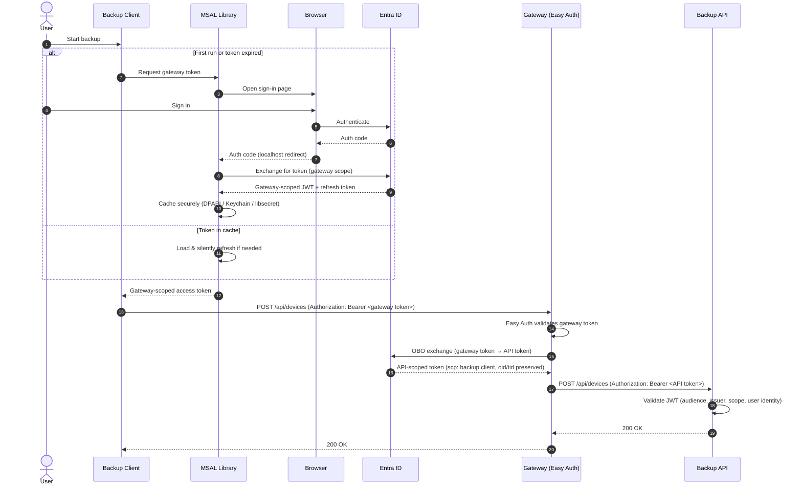

# Authentication Setup for Distributed Clients

This document explains how authentication works in the Backup API stack and how to set up a new distributed client installation.

## Architecture Overview

Clients never talk directly to the API. All traffic goes through a **Gateway** (Azure Container App) that handles authentication and forwards requests to the internal API.

```
Client  ──(gateway scope token)──▶  Gateway (Easy Auth)
                                        │
                                        │  OBO exchange
                                        ▼
                                    Entra ID
                                        │
                                        │  API scope token (user identity preserved)
                                        ▼
                                    Backup API  ──▶  Azure Blob
```

### Authentication Flow



### Why OBO (On-Behalf-Of)?

The Gateway exchanges the user's gateway-scoped token for an API-scoped token via the OAuth2 On-Behalf-Of flow. This serves two purposes:

1. **Audience isolation** — the client token targets the gateway (`api://5506a872...`); the API only accepts tokens for its own audience (`api://906eb0e3...`).
2. **User identity preservation** — the OBO token carries the user's `oid` and `tid` claims, which the API uses to scope stored data per user.

The Gateway requests only the scopes covered by tenant-wide consent (`backup.client`). Azure AD rejects the OBO exchange with `AADSTS65001` (consent_required) if any requested scope has no consent for that user — it does not silently drop unconsented scopes — so user-level access control is enforced at the Entra layer.

---

## App Registrations

Three app registrations are involved:

| App | ID | Purpose |
|-----|----|---------|
| Backup Client (public) | `a862c3a8-8dfa-46b6-9a5a-5cea65652416` | MSAL public client — no secret |
| Gateway | `5506a872-9273-48f8-8145-43181d406355` | Easy Auth + OBO credential |
| Backup API | `906eb0e3-e351-47c0-a68a-690207f4cccb` | JWT audience, defines scopes |

> **Important** — both the Gateway and API app registrations must have `requestedAccessTokenVersion: 2` in their manifest (`api` section). With the v1 default (`null`), client tokens carry the `sts.windows.net` issuer, which conflicts with Easy Auth's v2 issuer configuration and breaks `/.default` scope expansion in the OBO flow.

---

## Setting Up a New Client Installation

### 1. The MSAL public client app is already registered

`a862c3a8-8dfa-46b6-9a5a-5cea65652416` — this is the shared public client used by all installations. No secrets are needed because it is a public client (desktop app flow).

### 2. Grant the client permission on the Gateway

The client must be authorised to request a gateway-scoped token:

1. **Entra ID** → **App registrations** → `5506a872` (Gateway)
2. **Expose an API** → **Authorized client applications**
3. Add `a862c3a8-8dfa-46b6-9a5a-5cea65652416` with the `backup.access` scope

### 3. Regular user access (backup.client)

All users in the tenant are pre-consented for `backup.client` rights via an `AllPrincipals` admin consent grant on the Gateway → API permission. No per-user action is needed for standard backup clients.

### 4. Admin user access (backup.admin)

`backup.admin` is **not** granted to all users. It must be granted individually:

1. **Entra ID** → **Enterprise applications** → `906eb0e3` (Backup API)
2. **Permissions** → **Grant admin consent** → select the user
3. Grant the `backup.admin` delegated scope for that specific user

Or grant it to a security group and assign users to that group.

---

## Client Configuration

### Production (pointing at the hosted gateway)

Store sensitive values in user secrets (`dotnet user-secrets`), not in committed config files:

```json
{
  "BackupApiClient": {
    "ApiUrl": "https://<gateway-url>.azurecontainerapps.io",
    "AuthenticationScope": "api://5506a872-9273-48f8-8145-43181d406355/backup.access",
    "AuthenticationTenant": "cf8adfe1-bb3b-4ef0-8ba9-44dcddb8ecb9"
  }
}
```

> **Note** — `AuthenticationScope` targets the **Gateway** app (`5506a872`), not the API. The Gateway exchanges this token for an API-scoped token internally.

### Development (local API, no auth)

`appsettings.Development.json` points `ApiUrl` at `localhost`. The client detects a local URL and skips MSAL, using `NoOpTokenCredential` instead. No Entra setup is needed for local development.

---

## How Access Control Works End-to-End

1. **User authenticates** → MSAL acquires a JWT with `aud: api://5506a872...` and `scp: backup.access`
2. **Gateway validates** via Easy Auth → confirms the token is a valid Entra token for this tenant
3. **OBO exchange** → Gateway trades the user's gateway token for an API token:
   - Requests only `backup.client` (the scope covered by the `AllPrincipals` admin consent)
   - Resulting token has `aud: api://906eb0e3...`, `oid`/`tid` (user identity), and `scp: backup.client`
   - Note: Azure AD returns `AADSTS65001` if a requested scope has *no* consent for that user — it does not silently clip absent scopes
4. **API validates** → checks audience, issuer, expiry, and that `scp` contains `backup.client` or `backup.admin`
5. **Service layer** → uses `oid`+`tid` from the token to scope all data to that user

All users routed through the gateway get `scp: "backup.client"`. The API's scope gate accepts either `backup.client` or `backup.admin`. To request `backup.admin` in the OBO token (for a deployment where all users have that consent), set `Gateway__OboApiScopes` explicitly in the container app environment.

---

## Token Caching

MSAL caches tokens per platform:

| Platform | Storage |
|----------|---------|
| Windows | DPAPI (current-user encrypted) |
| macOS | Keychain |
| Linux | libsecret |

Cache location: `%LOCALAPPDATA%\FlorisDeV.BackupClient\backup-client.cache`

On subsequent runs MSAL silently refreshes from cache — no browser window unless the refresh token has also expired or been revoked.

---

## Security Properties

- **No client secrets** — public client flow is appropriate for unmanaged desktop installs
- **Gateway isolation** — the internal API is not publicly reachable; all access goes through the gateway
- **User identity in every request** — OBO preserves `oid`/`tid` so the API always knows which user is acting
- **Least-privilege by default** — all users get `backup.client`; `backup.admin` requires an explicit per-user grant
- **Short-lived tokens** — access tokens expire after ~1 hour; refresh tokens are revocable by an admin
- **Audience separation** — client tokens and API tokens have different audiences; a stolen client token cannot be replayed directly against the API

---

## References

- [JwtBearerAuthenticationHandler.cs](../src/common/security/Authentication/JwtBearerAuthenticationHandler.cs)
- [Gateway Program.cs](../src/services/gateway/Program.cs) — OBO exchange implementation
- [Microsoft identity platform — OBO flow](https://learn.microsoft.com/en-us/entra/identity-platform/v2-oauth2-on-behalf-of-flow)
- [MSAL.NET public client apps](https://learn.microsoft.com/en-us/entra/msal/dotnet/acquiring-tokens/desktop-mobile/acquiring-tokens-interactively)
- [Container Apps Easy Auth](https://learn.microsoft.com/en-us/azure/container-apps/authentication)
