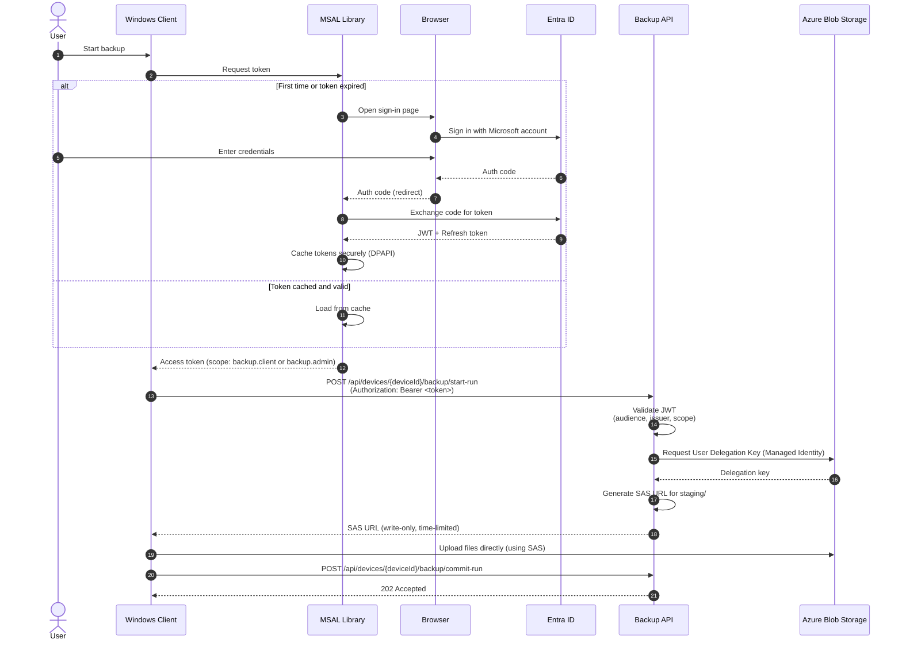

# Authentication Setup for Distributed Clients

This document explains how to set up authentication for the Backup Client in production environments where it's distributed to end users.

## Overview

The backup client uses **MSAL (Microsoft Authentication Library)** for interactive user authentication. This allows users to sign in with their Microsoft/Entra ID accounts and securely access the Backup API.

## Architecture



Key features:
- **Interactive authentication**: Users sign in via browser
- **Token caching**: Tokens are securely cached
- **Automatic refresh**: Tokens are refreshed before expiry
- **No secrets in client**: Public client flow (no client secrets stored)

## Entra ID App Registration

### 1. Register the Client Application

1. Go to [Azure Portal](https://portal.azure.com) → **Entra ID** → **App registrations**
2. Click **New registration**
3. Configure:
   - **Name**: `Backup Client`
   - **Supported account types**: `Accounts in this organizational directory only`
   - **Redirect URI**: 
     - Platform: `Public client/native`
     - URI: `http://localhost`
4. Click **Register**
5. **Copy the Application (client) ID** - you'll need this for configuration

### 2. Configure API Permissions

1. In your new app registration, go to **API permissions**
2. Click **Add a permission** → **My APIs**
3. Select your Backup API (the one with ClientId `906eb0e3-e351-47c0-a68a-690207f4cccb`)
4. Select **Delegated permissions**
5. Check `backup.client` for normal backup clients. Use `backup.admin` only for trusted administrative/operator clients.
6. Click **Add permissions**
7. **Optional**: Click **Grant admin consent** (if you want to pre-approve for all users)

### 3. Configure Authentication

1. Go to **Authentication** in your app registration
2. Under **Advanced settings**:
   - **Allow public client flows**: `Yes`
   - **Default client type**: `Yes - treat as public client`
3. Click **Save**

### 4. Update API App Registration (Allow Client Tokens)

The API also needs to accept tokens from the client app:

1. Go to your API's app registration (`906eb0e3-e351-47c0-a68a-690207f4cccb`)
2. Go to **Expose an API**
3. Under **Authorized client applications**, click **Add a client application**
4. Enter the **Client App ID** from step 1.5
5. Check the `backup.client` scope for the client app. Add `backup.admin` only for trusted administrative clients.
6. Click **Add application**

## Client Configuration

Update your client's `appsettings.json`:

```json
{
  "AzureAd": {
    "Instance": "https://login.microsoftonline.com/",
    "TenantId": "cf8adfe1-bb3b-4ef0-8ba9-44dcddb8ecb9",
    "ClientId": "YOUR_CLIENT_APP_ID_FROM_STEP_1.5"
  },
  "BackupApiClient": {
    "ApiUrl": "https://your-container-app-url.azurecontainerapps.io",
    "AuthenticationScope": "api://906eb0e3-e351-47c0-a68a-690207f4cccb/backup.client",
    "AuthenticationTenant": "cf8adfe1-bb3b-4ef0-8ba9-44dcddb8ecb9",
    "RetryOptions": {
      "MaxRetryAttempts": 3,
      "Delay": "00:00:02",
      "BackoffType": "Exponential"
    }
  }
}
```

## How Authentication Works

### First Run (No Cached Token)

1. User launches the backup client
2. Client detects no cached token
3. **Browser window opens** showing Microsoft sign-in page
4. User signs in with their Microsoft account
5. User **consents to permissions** (if not pre-approved by admin)
6. Browser redirects to `http://localhost` with auth code
7. Client exchanges auth code for token
8. **Token is cached securely** (Windows: DPAPI, macOS: Keychain, Linux: libsecret)
9. Client calls Backup API with token

### Subsequent Runs (Cached Token)

1. User launches the backup client
2. Client loads token from secure cache
3. If token is still valid → use it
4. If token is expired → **silently refresh** using refresh token
5. Client calls Backup API with token
6. **No browser interaction needed!**

## Token Caching Locations

Tokens are stored securely per platform:

- **Windows**: Encrypted with DPAPI (only current user can decrypt)
- **macOS**: Keychain
- **Linux**: libsecret

## Security Considerations

### ✅ Secure Aspects

- **No client secrets**: Public client flow is appropriate for desktop apps
- **Token caching**: Encrypted at rest using OS-provided secure storage
- **Short-lived tokens**: Access tokens expire (typically 1 hour)
- **Refresh tokens**: Longer-lived but revocable by admin
- **Scope-based access**: normal clients use the narrow `backup.client` delegated scope; `backup.admin` is reserved for trusted operator/admin scenarios
- **Per-user authentication**: Each user authenticates with their own account

### ⚠️ Important Notes

- **Public client limitation**: Client app cannot securely store secrets (this is expected for desktop apps)
- **Token extraction risk**: Advanced users could extract tokens from cache (but they're short-lived)
- **Device trust**: No device-level authentication (relies on user authentication)

### 🔒 API-Side Validation

The API validates:
1. Token signature (from Entra ID)
2. Audience (`api://906eb0e3-e351-47c0-a68a-690207f4cccb`)
3. Issuer (correct tenant)
4. Required scope (`backup.client` or `backup.admin`)
5. Token expiry

See [JwtBearerAuthenticationHandler.cs](../src/common/security/Authentication/JwtBearerAuthenticationHandler.cs)

## Development vs Production

### Development Mode

- Uses `NoOpTokenCredential` in the client
- Requires the local API to explicitly set `ALLOW_DEVELOPMENT_ANONYMOUS_AUTHENTICATION=true`
- No MSAL setup needed for the local Docker Compose flow
- Ideal for local API testing

### Production Mode

- Uses `MsalTokenCredential`
- Interactive browser-based authentication
- Token caching for better UX
- Requires Entra ID app registration
- Designed for distributed clients

The client automatically selects the appropriate credential based on `IHostEnvironment.IsDevelopment()`.

## References

- [Microsoft Identity Platform - Public client apps](https://learn.microsoft.com/en-us/entra/identity-platform/msal-net-initializing-client-applications#initializing-a-public-client-application-from-code)
- [MSAL.NET Token Cache Serialization](https://learn.microsoft.com/en-us/entra/msal/dotnet/how-to/token-cache-serialization)
- [MSAL.NET Browser-based authentication](https://learn.microsoft.com/en-us/entra/msal/dotnet/acquiring-tokens/desktop-mobile/acquiring-tokens-interactively)
