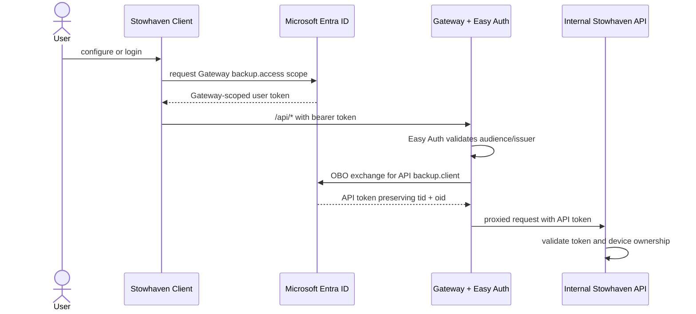

# Authentication and authorization

Hosted Stowhaven clients call the public Gateway. The Stowhaven API and worker have internal Container Apps ingress.



## Why the Gateway uses OBO

The user's token targets the Gateway audience. Passing it unchanged to the API would fail the API's audience validation. The OAuth 2.0 On-Behalf-Of exchange produces a token for the API while preserving the user's tenant and object identifiers, which the API uses for data isolation.

For bearer-token clients, Easy Auth validates the incoming Gateway token and the Gateway reads the bearer token as the OBO user assertion. Browser/cookie flows can instead supply Easy Auth's `X-MS-TOKEN-AAD-ACCESS-TOKEN` header.

Swagger document requests do not use OBO. The Gateway adds a deployment-specific internal header to reach the otherwise hidden API/worker Swagger documents.

## App and token boundaries

| Hop | Audience | Required permission |
| --- | --- | --- |
| Client → Gateway | `api://<gateway-client-id>` | delegated `backup.access` |
| Gateway → API, user request | `api://<api-client-id>` | delegated `backup.client` by default |
| Gateway → API, app-only fallback | API client ID or URI | application role `backup.gateway` |

The API accepts delegated `backup.client` or `backup.admin`, and the `backup.gateway` application role. Both API and Gateway app registrations should issue v2 access tokens.

The normal hosted client does not request `backup.admin`. Operational routes under `/api/ops/*` additionally require that delegated scope. The Gateway's `backup.gateway` application role and a normal `backup.client` token do not satisfy the operations policy.

## Client configuration

Production configuration targets the Gateway:

```json
{
  "AzureAd": {
    "Instance": "https://login.microsoftonline.com/",
    "TenantId": "<tenant-id>",
    "ClientId": "<public-client-id>"
  },
  "BackupApiClient": {
    "ApiUrl": "https://<gateway-host>.azurecontainerapps.io",
    "AuthenticationScope": "api://<gateway-client-id>/backup.access",
    "AuthenticationTenant": "<tenant-id>"
  }
}
```

These IDs, URL, and scope are identifiers rather than secrets. The public client has no client secret. Machine-specific backup targets belong in `appsettings.local.json`; see [Client configuration](CLIENT_CONFIGURATION.md).

In Development, when `ApiUrl` is a loopback URL, the client uses a no-op credential and the API's Development anonymous handler. A deployed URL still uses MSAL even if the client process itself runs with the Development environment.

## Interactive and unattended behavior

Only `backup-client configure` and `backup-client login` allow interactive authentication. They can open the system browser and populate the persistent MSAL cache.

Normal backup, restore, scheduled, and service runs are silent-only. If MSAL cannot refresh a cached token, the run stops and asks the operator to run `backup-client login`; an unattended process will not unexpectedly open a browser.

MSAL cache storage:

| Platform | Protection | Default path |
| --- | --- | --- |
| Windows | DPAPI | `%LOCALAPPDATA%\backup-client\backup-client.cache` |
| macOS | Keychain | application-data directory |
| Linux | libsecret/keyring | `~/.local/share/backup-client/backup-client.cache` |

## API authorization

Production controllers require authentication globally. After JWT validation:

- delegated tokens must include `backup.client` or `backup.admin`;
- app-only tokens must include `backup.gateway`;
- `/api/ops/*` requires a delegated token containing the exact `backup.admin` scope;
- device registration records the authenticated tenant/user identity;
- device-scoped backup and restore operations authorize that identity against the device registration.

The app-role fallback is intended for headless/internal Gateway calls. A user-facing request should use OBO so that `tid` and `oid` reach the API. An app-only token does not represent a user and cannot safely substitute for that identity on user-owned device operations.

## Deployment requirements

Set these GitHub repository values for the hosted flow:

- variable `GATEWAY_AUTH_CLIENT_ID`
- secret `GATEWAY_AUTH_CLIENT_SECRET`
- variable `API_AUTH_CLIENT_ID`
- variable `API_AUTH_AUDIENCE`

The GitHub workflow rejects a full deployment if required Gateway or API settings are missing. The Bicep template also defaults to a foundation-only deployment and omits Container Apps unless all authentication inputs are complete.

The Gateway managed identity's `backup.gateway` assignment is a manual post-deployment step today; use `scripts/Grant-GatewayApiAppRole.ps1` if the fallback path is required.

For the complete registration shapes and configuration locations, see [App registrations](APP_REGISTRATIONS.md).

## Security notes

- Do not log bearer tokens, MSAL cache contents, Gateway client secrets, SAS URLs, or encryption recovery phrases.
- Restrict user assignment on the Gateway enterprise application when the product is not tenant-wide.
- Rotate the Gateway OBO client secret before expiry and update the GitHub secret.
- Keep the API and worker ingress internal; only the Gateway should be public.
- Grant `backup.admin` only to dedicated operator clients and accounts; normal backup clients need only `backup.access` at the Gateway.

## References

- [Microsoft identity platform OBO flow](https://learn.microsoft.com/en-us/entra/identity-platform/v2-oauth2-on-behalf-of-flow)
- [MSAL.NET desktop authentication](https://learn.microsoft.com/en-us/entra/msal/dotnet/acquiring-tokens/desktop-mobile/acquiring-tokens-interactively)
- [Azure Container Apps authentication](https://learn.microsoft.com/en-us/azure/container-apps/authentication)
- [Gateway implementation](../src/services/gateway/Program.cs)
- [API JWT validation](../src/common/security/Authentication/JwtBearerAuthenticationHandler.cs)
