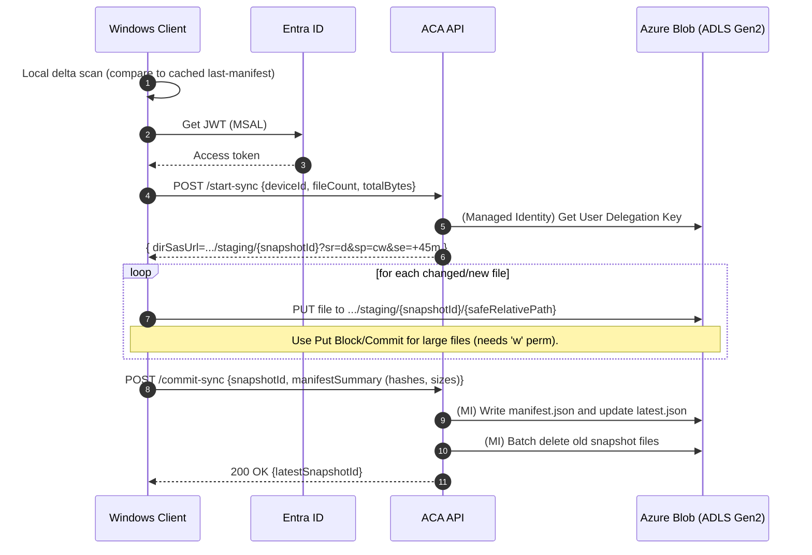

# Azure Backup API

A lightweight **.NET Azure Function API** that issues **temporary SAS URLs** to upload/download files to **Azure Blob Storage**, including:
- **Infrastructure as Code** with Terraform (Storage Account, Function App, Lifecycle rules, RBAC)
- **CI/CD** via GitHub Actions (OIDC login, infra deployment, code deployment)
- **Lifecycle policy**: automatically move blobs to Archive tier after 30 days of inactivity

## 📂 Project Structure

```
.
├── src/
│   ├── services/api/           # .NET Azure Function code
│   │   ├── Controllers/        # API controllers
│   │   ├── Services/           # Business logic services
│   │   ├── Models/             # Data models
│   │   ├── Constants/          # Application constants
│   │   ├── Program.cs          # Function App entry point
│   │   ├── ProgramExtensions.cs# Configuration extensions
│   │   └── FlorisDeV.BackupApi.csproj
│   └── common/                 # Shared libraries
│       ├── featureflags/       # Feature flag management
│       ├── healthchecks/       # Health check implementations
│       └── logging/            # Logging and telemetry
├── deploy/terraform/           # Terraform IaC templates
│   ├── main.tf                 # Main infrastructure
│   ├── storage.tf              # Storage account resources
│   ├── container_app.tf        # Container app configuration
│   ├── iam.tf                  # Identity and access management
│   └── ...                     # Other infrastructure components
├── tests/                      # Unit and integration tests
├── .github/workflows/          # GitHub Actions CI/CD
│   ├── build.yml              # Build pipeline
│   ├── infrastructure.yml     # Infrastructure deployment
│   ├── deploy.yml             # Application deployment
│   └── full-pipeline.yml      # Orchestrated full deployment
├── run/                        # Local development (Dapr)
├── doc/                        # Documentation
└── docker-compose.yml          # Local containerized development
```

## 🚀 Deployment

### 1. Prerequisites
- **Azure CLI** (min. 2.57)
- **Terraform** (min. 1.5.0)
- **.NET 9.0 SDK**
- **Azure Functions Core Tools v4**
- **GitHub CLI** (optional, for automated secret setup)

> **Note**: The project uses .NET 9, but Terraform configuration specifies .NET 8.0 due to Azure RM provider limitations. Azure Functions v4 supports .NET 9 deployments regardless of this setting.

### 1.1. Setup GitHub OIDC Authentication
Run the provided script to automatically create the Azure AD application and GitHub secrets:

```powershell
# PowerShell
.\setup-github-secrets.ps1 "YourGitHubUsername/backup-api"

# Or with custom parameters
.\setup-github-secrets.ps1 "YourGitHubUsername/backup-api" "your-subscription-id" "CustomAppName"
```

```cmd
# Command Prompt
setup-github-secrets.cmd YourGitHubUsername/backup-api
```

This script will:
- Create an Azure AD application and service principal
- Set up federated credentials for OIDC authentication
- Assign the Contributor role to your subscription
- Optionally add the secrets to GitHub (if GitHub CLI is installed)

**Manual Setup**: If you prefer manual setup, the workflow requires these secrets:
- `AZURE_SUBSCRIPTION_ID`
- `AZURE_TENANT_ID` 
- `AZURE_CLIENT_ID`

### 1.2. Grant User Access Administrator Role

⚠️ **IMPORTANT**: Your Service Principal needs additional permissions to create role assignments for managed identities.

After running the setup script, grant the **User Access Administrator** role:

```bash
# Replace with your actual values from the setup script output
AZURE_CLIENT_ID="your-service-principal-client-id"
AZURE_SUBSCRIPTION_ID="your-subscription-id"
RESOURCE_GROUP="rg-fdev-weu-backup-prd"

# Grant User Access Administrator role (resource group scope)
az role assignment create \
  --assignee $AZURE_CLIENT_ID \
  --role "User Access Administrator" \
  --scope "/subscriptions/$AZURE_SUBSCRIPTION_ID/resourceGroups/$RESOURCE_GROUP"
```

**Alternative: Subscription-level access** (if you plan to deploy to multiple resource groups):
```bash
az role assignment create \
  --assignee $AZURE_CLIENT_ID \
  --role "User Access Administrator" \
  --scope "/subscriptions/$AZURE_SUBSCRIPTION_ID"
```

**Verify the assignment**:
```bash
az role assignment list \
  --assignee $AZURE_CLIENT_ID \
  --output table
```

**Why this is needed**: The Service Principal needs to assign the "Storage Blob Data Contributor" role to the Function App's managed identity during deployment. Without this permission, the deployment will fail with an authorization error.

### 2. Create a Resource Group
```bash
az group create -n rg-backup-archive -l westeurope
```

### 3. Pipeline Structure

This project uses separate build and release pipelines for better organization:

#### 🏗️ **Build Pipeline** (`.github/workflows/build.yml`)
- Triggers on: Push to `main`/`develop`, PRs to `main`
- Builds and tests the .NET application
- Creates versioned artifacts
- Runs on every code change

#### 🏭 **Infrastructure Pipeline** (`.github/workflows/infrastructure.yml`)
- Triggers on: Changes to `infra/` folder
- Deploys/updates Azure resources via Terraform
- Can be run manually with destroy option
- Independent of application code

#### 🚀 **Deploy Pipeline** (`.github/workflows/deploy.yml`)
- Triggers automatically after successful build
- Downloads build artifacts and deploys to Azure Functions
- Can deploy any previous build artifact
- Supports manual deployment with artifact selection

#### 🔄 **Full Pipeline** (`.github/workflows/full-pipeline.yml`)
- Orchestrates all pipelines together
- Good for complete deployments
- Allows skipping individual steps

**Usage Examples:**
```bash
# Deploy latest code (auto-triggers on push to main)
git push origin main

# Deploy specific build to staging
# Use GitHub UI: Actions → Deploy → Run workflow
# - Environment: staging
# - Build number: 42

# Update only infrastructure
# Use GitHub UI: Actions → Infrastructure → Run workflow

# Emergency rollback
# Use GitHub UI: Actions → Deploy → Run workflow  
# - Build number: 35 (previous working build)
```

### 4. Legacy Single Pipeline

The old monolithic pipeline is still available in `deploy.yml.old` but is not recommended for production use.

* Push to the `main` branch → triggers infra + code deployment automatically.

### 5. Local Testing

```bash
# Navigate to the API project
cd src/services/api

# Restore dependencies
dotnet restore

# Run locally with Azure Functions Core Tools
func start
```

For local development with Dapr:
```bash
# Start with Docker Compose (includes Dapr sidecar)
docker-compose up

# Or run Dapr directly
dapr run --app-id backup-api --app-port 7071 --dapr-http-port 3500 -- func start
```

## 🗝 Usage

### Request an Upload SAS URL

```bash
curl -X POST "https://<functionapp>.azurewebsites.net/api/get-sas-upload" \
  -H "x-api-key: <YOUR_API_KEY>" \
  -d '{"path":"d/Projects/file.zip","ttl_minutes":60}'
```

### Upload with AzCopy

```bash
azcopy copy "D:\Projects\file.zip" "<sas_url>" --overwrite=false
```

### Lifecycle Rule

* All blobs in `backups/` → moved to Archive tier **after 30 days** without modification.

## Transaction Diagram
