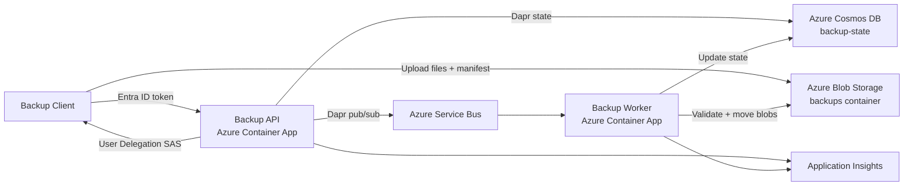

# Azure Backup API

[](https://github.com/FlorisDeVries/backup-api/actions/workflows/deploy.yml)


Azure Backup API is a low-cost, cloud-native backup service built with **.NET 10**, **Azure Container Apps**, **Dapr**, **Azure Blob Storage**, and **Azure Cosmos DB for NoSQL**.

The API issues short-lived, least-privilege SAS URLs so backup clients can upload encrypted or plaintext backup data directly to Azure Blob Storage. The service keeps the control plane small and cheap while the bulk data path goes straight from client to storage.

## What this repository contains

- **Backup API**: public HTTP API for device registration, backup run orchestration, SAS issuance, commit status, restore metadata, health checks, and operational endpoints.
- **Backup Worker**: background Container App that consumes Dapr pub/sub commit events and finalizes staged backup runs.
- **Backup Client**: .NET console/Windows-service-friendly client that scans configured targets, applies `.backupignore` rules, uploads changed files, and commits runs.
- **Shared libraries**: contracts, core services, health checks, logging, feature flags, and security helpers.
- **Infrastructure-as-Code**: Bicep deployment for Storage, Cosmos DB containers, Service Bus, Key Vault, Container Apps, ACR, monitoring, Dapr components, and managed-identity RBAC.
- **CI/CD**: GitHub Actions workflow using Azure OIDC and a multi-phase deployment.

## Key features

- **Direct-to-Blob uploads** using directory-scoped User Delegation SAS.
- **No storage account keys** in clients or application settings.
- **Incremental backup flow**: upload only new or changed files.
- **Asynchronous commit pipeline** via Dapr pub/sub and a dedicated worker.
- **Cosmos DB-backed Dapr state stores** for manifest state and device registry state.
- **Optional zero-knowledge client-side encryption** through the backup client.
- **Blob lifecycle management** for low-cost long-term retention.
- **Managed identity-first Azure access** for Storage, Cosmos DB, Service Bus, Key Vault, and ACR pull.
- **Production observability** through Application Insights and Log Analytics.
- **Local development stack** with Docker Compose, Dapr sidecars, Azurite, Redis, Zipkin, and the Aspire dashboard.

## Architecture at a glance



The API is responsible for authentication, authorization, SAS issuance, and queuing commit work. The worker performs the heavier commit processing: validating staged blobs, moving active versions into place, retiring older versions, and updating Dapr state.

## Backup flow

1. The client authenticates with Microsoft Entra ID.
2. The client registers or resolves its device record through the API.
3. The client starts a backup run for a device.
4. The API creates run state and returns a short-lived SAS for `staging/{deviceId}/{runId}/`.
5. The client scans configured targets and uploads only changed/new files directly to Blob Storage.
6. The client uploads `run-manifest.json` under `runs/{deviceId}/{runId}/`.
7. The client calls the commit endpoint.
8. The API publishes a commit event through Dapr pub/sub.
9. The worker validates the run, moves files into `devices/{deviceId}/files/`, retires old versions, and updates Cosmos DB state.
10. The client polls commit status until the run succeeds or fails.

## Main API surface

| Area | Endpoint |
| --- | --- |
| Device registration | `POST /api/devices` |
| Device lookup | `GET /api/devices/{deviceId}` |
| Start backup run | `POST /api/devices/{deviceId}/backup/start-run` |
| Commit backup run | `POST /api/devices/{deviceId}/backup/commit-run` |
| Commit status | `GET /api/devices/{deviceId}/backup/commit-status/{commitId}` |
| Restore file listing | `GET /api/devices/{deviceId}/restore/files` |
| Start restore | `POST /api/devices/{deviceId}/restore/start` |
| Health | `GET /api/health`, `GET /api/health/alive`, `GET /api/health/ready` |
| Operations | `GET /api/ops/*`, `POST /api/ops/*` |

The worker exposes an internal Dapr subscription endpoint at `POST /api/BackupEvents/backup-run-committed`.

## Storage and state model

Production uses one Storage account and the `backups` Blob container:

```text
backups/
  devices/{deviceId}/
    files/{uniqueFileId}      # active file versions
    retired/{uniqueFileId}    # older versions pending cleanup

  staging/{deviceId}/{runId}/
    {uniqueFileId}            # temporary upload area

  runs/{deviceId}/{runId}/
    run-manifest.json         # submitted run manifest
```

Authoritative state is stored through Dapr in Azure Cosmos DB for NoSQL:

- database: `backup-state`
- manifest container: `manifest-state`
- device registry container: `device-registry`

Bicep creates the database and containers in the existing Cosmos DB account configured by `deploy/bicep/main.bicepparam`.

## Lifecycle and retention

The production storage account is configured for long-term, low-cost backup retention:

- Uploads may initially land in the account default **Cool** tier.
- Lifecycle rules move committed backup files under `backups/devices/` to **Cold** as soon as the policy runs.
- Committed files move to **Archive** after 30 days.
- Active backup files are **not deleted** by lifecycle policy.
- Retired file versions can be deleted after the configured retention window.
- Staging blobs are cleaned up after a short grace period.

## Repository layout

```text
.
├── src/
│   ├── services/
│   │   ├── api/                 # Backup API Container App
│   │   ├── worker/              # Commit worker Container App
│   │   └── client/              # Backup client executable
│   └── common/
│       ├── contracts/           # Shared API/application/state contracts
│       ├── core/                # Shared backup services and domain logic
│       ├── featureflags/        # Azure App Configuration feature flags
│       ├── healthchecks/        # Dapr and Azure Storage health checks
│       ├── logging/             # Serilog/OpenTelemetry/Application Insights setup
│       └── security/            # Authentication and authorization helpers
├── tests/                       # Unit and integration-style tests
├── deploy/bicep/                # Azure infrastructure modules and parameters
├── run/                         # Local Dapr components and configuration
├── dapr/                        # Additional Dapr component definitions
├── doc/                         # Project documentation
├── .github/workflows/deploy.yml # GitHub Actions deployment workflow
├── docker-compose.yml           # Local development environment
└── FlorisDeV.BackupApi.sln      # Solution file
```

## Prerequisites

For local development:

- .NET 10 SDK
- Docker and Docker Compose
- Git

For Azure deployment:

- Azure CLI
- Bicep CLI, or Azure CLI with Bicep support
- Azure subscription with the required resource providers registered
- Existing free-tier or standard Azure Cosmos DB for NoSQL account
- GitHub repository configured for Azure OIDC deployment

## Local development

Start the local stack:

```bash
docker compose up --build
```

Useful local URLs:

| Service | URL |
| --- | --- |
| Backup API | `http://localhost:8210` |
| Backup Worker | `http://localhost:8220` |
| Zipkin | `http://localhost:9411` |
| Aspire dashboard | `http://localhost:18888` |
| RedisInsight | `http://localhost:5540` |

The Docker Compose environment runs with `ASPNETCORE_ENVIRONMENT=Development`. Development appsettings intentionally point OpenTelemetry to local Zipkin and the Aspire dashboard. Production appsettings leave those exporter endpoints empty and use Application Insights through the Azure deployment configuration.

Run the test suite:

```bash
dotnet test FlorisDeV.BackupApi.sln --no-restore --verbosity minimal
```

Run the client directly during development:

```bash
cd src/services/client
dotnet run
```

See [Client Configuration Guide](CLIENT_CONFIGURATION.md) for target configuration, scheduling, encryption, and `.backupignore` behavior.

## Azure deployment

Infrastructure lives in `deploy/bicep/` and is orchestrated by `deploy/bicep/main.bicep` with defaults in `deploy/bicep/main.bicepparam`.

The GitHub Actions workflow uses four phases:

1. Validate Bicep.
2. Deploy foundation resources with `deployContainerApps=false`.
3. Build and push the API and worker images to ACR.
4. Deploy or update Container Apps with `deployContainerApps=true`.

This avoids first-deployment issues where Container Apps need images and registry pull permissions before app revisions can start.

For setup details, see [GitHub Actions deployment setup](GITHUB_ACTIONS_DEPLOYMENT.md).

## Production Azure resources

The Bicep deployment provisions or references:

- Azure Storage account with the `backups` container and lifecycle policy.
- Azure Cosmos DB for NoSQL database and state containers.
- Azure Service Bus namespace, topic, and subscription for commit events.
- Azure Key Vault for Dapr secret references.
- Azure Container Registry with admin user disabled.
- Azure Container Apps environment.
- Backup API and Backup Worker Container Apps with Dapr enabled.
- Log Analytics workspace and Application Insights resource.
- Managed identities and least-privilege role assignments.

## Documentation

### Getting started

- [Client Configuration Guide](CLIENT_CONFIGURATION.md) - backup targets, common client settings, scheduling, and quick start.
- [.backupignore Reference](BACKUPIGNORE.md) - exclusion syntax and default ignore behavior.
- [GitHub Actions deployment setup](GITHUB_ACTIONS_DEPLOYMENT.md) - production deployment with Azure OIDC.

### Architecture and operations

- [Technical Design](TECHNICAL_DESIGN.md) - full architecture, flows, storage layout, state model, and security design.
- [Authentication](AUTHENTICATION.md) - Entra ID authentication and authorization model.
- [Monitoring](MONITORING.md) - logs, metrics, health checks, and diagnostics.
- [Advanced Configuration](ADVANCED_CONFIGURATION.md) - performance tuning, resilience, encryption, and advanced client scenarios.
- [Testing Guide](TESTING.md) - test strategy and client testing instructions.

### Cost reference

- [Cost Analysis](costs/) - storage tiering and cost optimization notes.

## Current project status

This project is an active implementation of a personal Azure backup system. The production deployment path, infrastructure modules, client, API, worker, and tests are present in this repository. The design intentionally favors a small API surface, direct Blob uploads, managed identity, Dapr abstractions, and low long-term storage cost.
