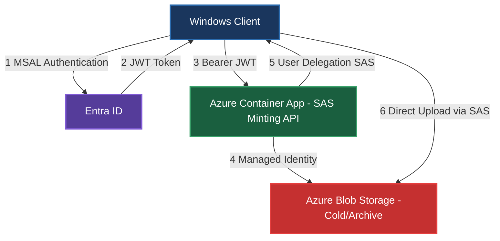
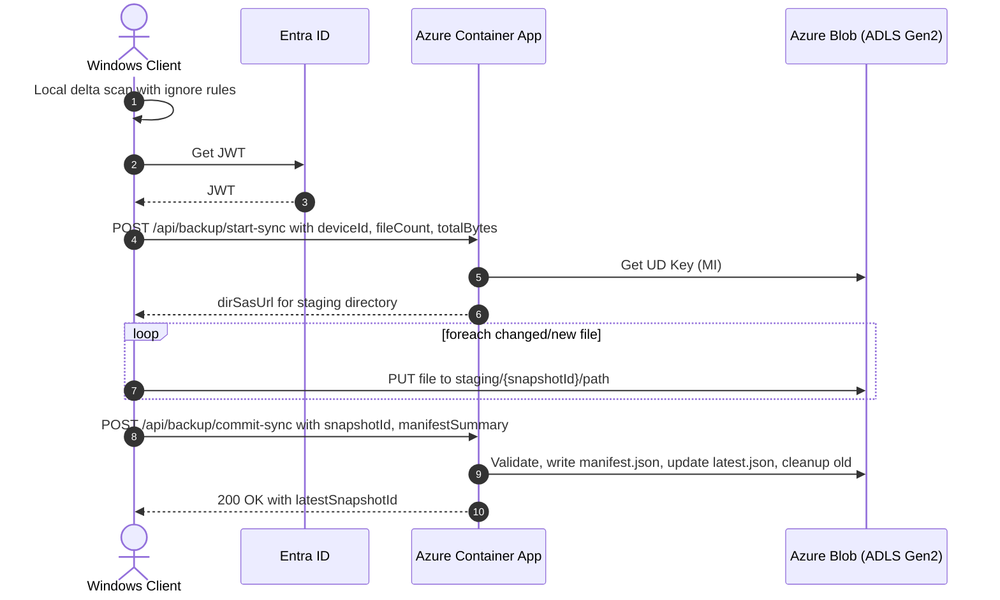

# Cloud Backup API - Technical Design

## 1) Goals & Non-Goals

**Goals**
- Ultra-low cost cloud backup (~€2/TB/month when data is rarely read) by pushing bulk data straight to Azure Blob with minimal control-plane calls.
- Zero exposure of account keys; clients get **time-boxed, least-privilege** write access only via SAS URLs.
- **Incremental multi-file sync** (upload only new/changed files).
- Leverage existing .NET Azure Container Apps infrastructure with Terraform IaC and GitHub Actions CI/CD.

**Non-Goals**
- Full enterprise backup feature set (PST/VHD consistent snapshots via VSS, cross-platform Linux/macOS, etc.).
- Rich restore UX; a minimal "download latest" flow is sufficient for v1.
- Complex orchestration; keep the API surface minimal and stateless.

**Assumptions**
- All clients are Windows.
- Azure Subscription available with: Azure Container Apps, Azure Blob Storage (GPv2), Microsoft Entra ID.
- Encryption is applied client-side before/while uploading.
- Existing Terraform infrastructure can be extended for backup-specific resources.

---

## 2) Architecture Overview



Key ideas:
- The **Windows client** authenticates to Azure Container App via Entra ID (MSAL).
- Azure Container App uses its **Managed Identity** + **Storage Blob Delegator** role to mint **User Delegation SAS** (UD-SAS).
- The client uploads **directly to Blob** using a short-lived SAS with narrow scope (write/create only), minimizing Container App traffic and costs.

---

## 3) Storage Layout & Naming

Per device namespace under a single container (example: `backups`):

```
/devices/{deviceId}/
  latest.json                             # pointer to current snapshot
  snapshots/{snapshotId}/manifest.json    # file list + metadata
  snapshots/{snapshotId}/files/...        # uploaded files (hierarchical)
  staging/{snapshotId}/...                # temp area for in-progress uploads
```

**IDs**
- `deviceId`: deterministic (e.g., stable GUID per PC).
- `snapshotId`: UTC timestamp + random suffix; e.g., `2025-09-16T14-30-15Z_5M8k3p`.

**Tiering**
- Choose **Cool/Cold** for frequent churn (30/90 day minimum retention).
- Choose **Archive** only for rare rotations (180 day minimum).
- Configured via Terraform lifecycle management policies.

---

## 4) Data Flows (Sequence)

### 4.1 Incremental multi-file sync (HNS ON recommended)



> **HNS ON** enables directory-scoped SAS (`sr=d`). If HNS is **OFF**, fall back to minting **per-blob** SAS URLs in batches.

---

## 5) Security Model

- **No account keys** on clients.
- Clients receive **short-lived UD-SAS** with:
  - `sp=w` (+`c` for create operations), **no read/list/delete**.
  - Scope: specific directory for multi-file uploads (HNS ON required).
  - `spr=https` only; optional `sip` (client IP) restriction.
  - Expiry: 15–60 minutes typical.
- Azure Container App authenticates via Entra (App Registration) and uses its **Managed Identity** for storage actions.
- Optional: **Blob index tags** (e.g., `state=retired`) to drive lifecycle cleanup policies.

---

## 6) Azure Container Apps API Contract (v1)

Base URL: `https://{container-app-name}.{region}.azurecontainerapps.io`

### 6.1 `POST /api/backup/start-sync`
**Headers:** `Authorization: Bearer {jwt}`

**Request**
```json
{
  "deviceId": "pc-1234",
  "fileCount": 7421,
  "totalBytes": 987654321
}
```

**Response**
```json
{
  "snapshotId": "2025-09-16T14-30-15Z_9sDf9a",
  "dirSasUrl": "https://.../staging/{snapshotId}?sr=d&sp=cw&se=..."
}
```

### 6.2 `POST /api/backup/commit-sync`
**Headers:** `Authorization: Bearer {jwt}`

**Request**
```json
{
  "snapshotId": "2025-09-16T14-30-15Z_9sDf9a",
  "manifest": {
    "files": [
      { "path": "Users/Alice/Documents/tax.pdf", "size": 81234, "sha256": "..." }
    ],
    "totalBytes": 987654321,
    "fileCount": 7421
  }
}
```

**Response**
```json
{
  "latestSnapshotId": "2025-09-16T14-30-15Z_9sDf9a"
}
```

### 6.3 `GET /api/backup/latest?deviceId=pc-1234`
**Headers:** `Authorization: Bearer {jwt}`

**Response**
```json
{
  "type": "snapshot",
  "id": "2025-09-16T14-30-15Z_9sDf9a",
  "manifestUrl": "https://.../snapshots/{id}/manifest.json?...readSas...",
  "createdUtc": "2025-09-16T14:30:15Z"
}
```

**Notes**
- Azure Container App validates uploads (HEAD + properties) before publishing `latest.json`.
- Concurrency: `latest.json` is updated with **ETag/lease** to prevent races.
- Old content is deleted **server-side** (or marked `state=retired` for lifecycle).

---

## 7) .NET Implementation Details

### 7.1 Container App Structure
```
Controllers/
  BackupController.cs          # Main API endpoints
Services/
  ISasService.cs              # SAS token generation interface
  SasService.cs               # User Delegation SAS implementation
  IBackupService.cs           # Business logic interface
  BackupService.cs            # Core backup orchestration
Models/
  StartSyncRequest.cs         # Request/response models
  CommitSyncRequest.cs
  ...
Constants/
  BackupConstants.cs          # Storage paths, timeouts, etc.
```

### 7.2 Key Dependencies
```xml
<PackageReference Include="Azure.Storage.Blobs" Version="12.19.1" />
<PackageReference Include="Azure.Identity" Version="1.10.4" />
<PackageReference Include="Microsoft.AspNetCore.Authentication.JwtBearer" Version="8.0.0" />
<PackageReference Include="Microsoft.AspNetCore.Authorization" Version="8.0.0" />
```

### 7.3 Configuration (via Terraform)
```csharp
// appsettings.json / Environment Variables
{
  "STORAGE_ACCOUNT_NAME": "backupstg{suffix}",
  "BACKUP_CONTAINER_NAME": "backups",
  "SAS_EXPIRY_MINUTES": "45",
  "MAX_UPLOAD_SIZE_MB": "10240"
}
```

### 7.4 Authentication & Authorization
- Use `Microsoft.AspNetCore.Authentication.JwtBearer` for JWT validation.
- Configure Entra ID App Registration in Terraform.
- Validate `deviceId` ownership through JWT claims (e.g., `sub` or custom claim).
- Standard ASP.NET Core authorization patterns with policies.

---

## 8) Infrastructure (Terraform Extensions)

### 8.1 Additional Resources Needed
```hcl
# Backup-specific container
resource "azurerm_storage_container" "backups" {
  name                  = "backups"
  storage_account_name  = azurerm_storage_account.main.name
  container_access_type = "private"
}

# Hierarchical Namespace (for directory SAS)
resource "azurerm_storage_account" "main" {
  # ... existing config ...
  is_hns_enabled = true  # Enable ADLS Gen2 features
}

# Additional RBAC for backup operations
resource "azurerm_role_assignment" "backup_blob_delegator" {
  scope                = azurerm_storage_account.main.id
  role_definition_name = "Storage Blob Delegator"
  principal_id         = azurerm_container_app.main.identity[0].principal_id
}

# Lifecycle management policy
resource "azurerm_storage_management_policy" "backup_lifecycle" {
  storage_account_id = azurerm_storage_account.main.id

  rule {
    name    = "delete-retired-backups"
    enabled = true

    filters {
      prefix_match = ["backups/devices/"]
      blob_types   = ["blockBlob"]
      
      blob_index_match {
        name      = "state"
        operation = "=="
        value     = "retired"
      }
    }

    actions {
      base_blob {
        delete_after_days_since_modification_greater_than = 95
      }
    }
  }
}
```

### 8.2 Container App Configuration
```hcl
resource "azurerm_container_app" "main" {
  # ... existing config ...
  
  template {
    container {
      # ... existing container config ...
      
      env {
        name  = "STORAGE_ACCOUNT_NAME"
        value = azurerm_storage_account.main.name
      }
      
      env {
        name  = "BACKUP_CONTAINER_NAME"
        value = azurerm_storage_container.backups.name
      }
      
      env {
        name  = "SAS_EXPIRY_MINUTES"
        value = "45"
      }
    }
  }
}
```

---

## 9) Windows Client Design

### 9.1 Delta Scanner (drive-level)
- Maintain a **local state DB** (JSON or SQLite) with: `relativePath`, `length`, `lastWriteUtc`, optional `sha256`, optional NTFS **File ID** (FRN).
- One pass per run:
  - Compile ignore rules; walk with `EnumerationOptions` (ignore inaccessible; skip reparse points).
  - Shortlist changes via `(size, mtime)`; compute `sha256` only for candidates.
  - Deletions = previous entries not seen this run.
- **Blacklist rules** via a `.backupignore` file (gitignore-style) per device/drive.

Example `.backupignore`:
```
# system dirs
$RECYCLE.BIN/
System Volume Information/
Windows/
Program Files*/

# patterns
**/*.tmp
**/*.log
**/*.bak
**/~$*.doc*
**/node_modules/
**/.git/
```

### 9.2 Uploader
- Large **Block Blob** uploads with parallel `Put Block` + `Put Block List`.
- Block size 128–256 MiB typical; tune threads by CPU/IOPS.
- Headers:
  - `x-ms-blob-type: BlockBlob`
  - `x-ms-access-tier: Cold|Cool|Archive` (set at upload time)
  - `If-None-Match: *` (create-only)
- Integrity:
  - Rolling **MD5/CRC64** and/or **SHA-256** per file; send in `/commit-*` for server validation.
- Resume:
  - Re-stage missing blocks and re-commit if interrupted (idempotent on `snapshotId + block IDs`).

---

## 10) Cost Management & Retention

- **Minimum retention**: Cool (30 d), Cold (90 d), Archive (180 d). Early deletion fees apply if blobs are deleted/overwritten sooner.
- To **avoid penalties** while rotating frequently:
  - Always upload to **new names** (suffix/timestamp).
  - Mark previous blobs `state=retired` and use **Lifecycle Management** to delete after the tier's min days.
- **Container App costs**: Pay-per-use model keeps costs minimal for infrequent backup operations.

### Example Cost Estimate (1TB/month)
- **Storage**: €2-4/TB/month (Cool/Cold tier)
- **Transactions**: ~€0.10/month (assuming 10k operations)
- **Container App execution**: ~€0.10/month (minimal compute time and scaling)
- **Egress**: €0 (uploads are ingress; downloads charged separately)

---

## 11) Reliability, Idempotency & Retries

- **Idempotent commits**: `/commit-*` uses `snapshotId`; replays are safe.
- **Pointer update** (`latest.json`) protected by ETag/lease; retries with backoff.
- **Exponential backoff + jitter** for network/storage retries.
- **Checksums** verified server-side before publishing.
- **Partial uploads** never become current; old latest remains valid.
- **Container App reliability**: Stateless design; all state in blob storage.

---

## 12) Observability

- **Client metrics**: files scanned/changed, bytes uploaded, throughput, duration, failures.
- **Container App logs**: request IDs, mint/commit events, validation failures, pointer updates.
- **Storage metrics**: egress/ingress, transactions, capacity by tier.
- **Application Insights**: End-to-end tracing with correlation IDs.
- Add **correlation IDs** (deviceId + snapshotId) across client/Container App/logs.

---

## 13) Development & Deployment

### 13.1 Local Development
- Use Azurite for local storage emulation.
- Mock Entra ID authentication for testing.
- Docker Compose setup for integrated testing.

### 13.2 CI/CD Pipeline Extensions
```yaml
# .github/workflows/deploy.yml additions
- name: Deploy Container App
  run: |
    dotnet publish src/Services/api --configuration Release
    # Build and deploy container image to Azure Container App using existing pipeline
```

### 13.3 Testing Strategy
- **Unit tests**: SAS generation, request validation, business logic.
- **Integration tests**: End-to-end upload flows with test storage account.
- **Load tests**: Concurrent uploads, large file handling.
- **Security tests**: SAS permission validation, authentication flows.

---

## 14) Security Considerations

- Enforce HTTPS, short SAS TTLs, optional IP restriction (`sip`).
- No delete/list permissions in SAS; deletes only via Container App with Managed Identity.
- Consider **immutability policies** (time-based retention) for ransomware resistance (optional).
- Optional: **Encryption scopes** to enforce SSE configuration; client-side encryption recommended regardless.
- **Input validation**: Strict validation of deviceId, file paths, sizes.
- **Rate limiting**: Implement throttling to prevent abuse.

---

## 15) Configuration Matrix (Key Knobs)

| Setting | Default | Notes |
|---|---|---|
| Tier | Cold | Use Cool for shorter retention or Archive for infrequent rotation |
| HNS | ON (required) | Enables directory-scoped SAS (`sr=d`) |
| SAS TTL | 45 min | Balance UX vs. exposure |
| Block size | 128–256 MiB | Tune for throughput/ops cost |
| Hashing | Candidates only | SHA-256 only for changed/new files |
| Ignore rules | .backupignore | Gitignore-style, per drive |
| Function timeout | 10 min | For commit operations |

---

## 16) Future Enhancements

- **Content-addressed storage** (global dedup by `sha256` under `/objects/{hash}` + manifests as references).
- **Delta/rsync-like** chunking for large files.
- **Restore service** that assembles a zip/7z on demand (beware egress costs).
- **Rehydration manager** for Cold/Archive restores (queue + notifications).
- **Versioning UI** and per-folder policies.
- **Multi-region replication** for disaster recovery.
- **Durable Functions** for long-running operations and orchestration.

---

## 17) Implementation Phases

### Phase 1: MVP (Multi-file sync)
- Basic SAS minting function for directory uploads
- Multi-file sync flow with manifest management
- Simple client prototype with delta scanning
- Basic Terraform extensions for HNS-enabled storage

### Phase 2: Enhanced Features
- Advanced client scanner optimizations
- Improved error handling and retries
- Performance tuning for large file sets
- Enhanced manifest validation

### Phase 3: Production Hardening
- Comprehensive error handling
- Performance optimizations
- Security enhancements
- Monitoring and alerting

### Phase 4: Advanced Features
- Content deduplication
- Restore workflows
- Multi-device management
- Web-based management portal

---

## 18) Risks & Mitigations

- **Frequent rotation + Archive** → early deletion fees. Mitigate by using Cool/Cold or lifecycle with delayed deletion.
- **Large directory trees** → slow scans. Mitigate with USN Journal & ignore rules.
- **Locked files** → inconsistent reads. Mitigate with VSS in later iteration.
- **Network instability** → failed uploads. Mitigate with block resumes and retries.
- **Function cold starts** → slow initial requests. Consider Premium plan or keep-warm strategies.
- **Storage account limits** → hitting transaction/bandwidth limits. Mitigate with multiple storage accounts or premium tiers.

---

## 19) Success Metrics

- **Cost efficiency**: Stay under €3/TB/month all-in cost.
- **Reliability**: 99.9% successful backup completion rate.
- **Performance**: Complete 100GB backup in under 2 hours on typical home broadband.
- **Security**: Zero account key exposures, all access via time-limited SAS.
- **Usability**: One-click backup initiation, automated scheduling.
