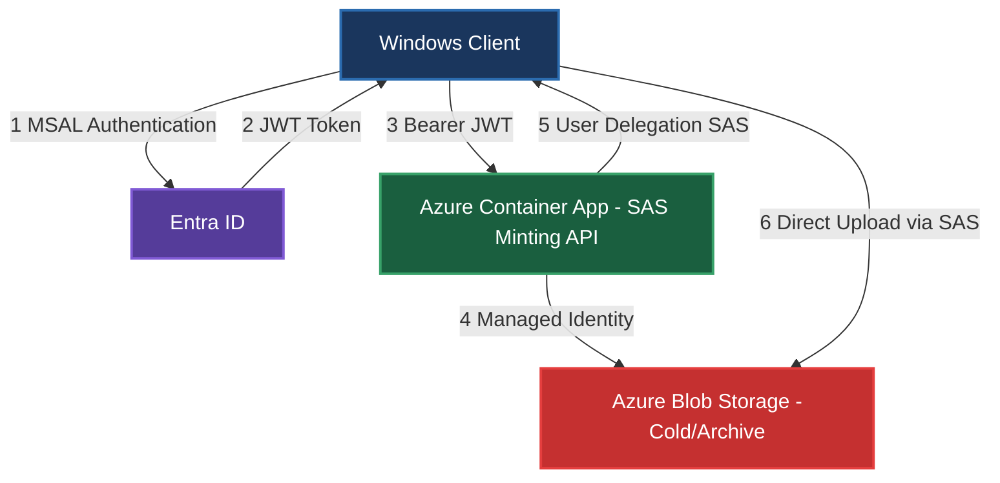
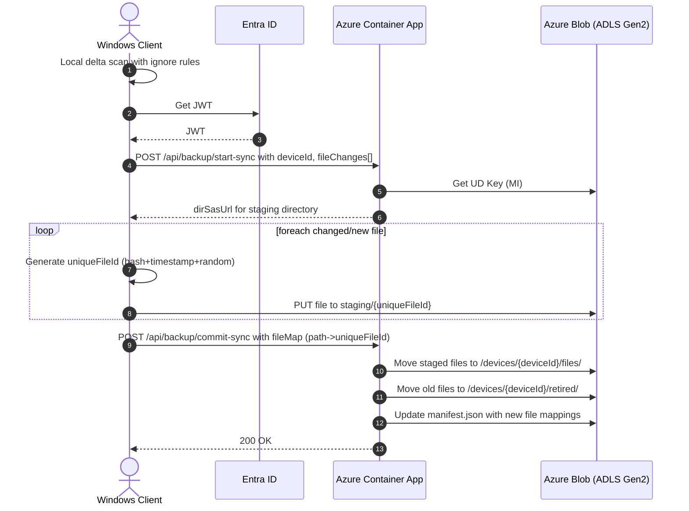
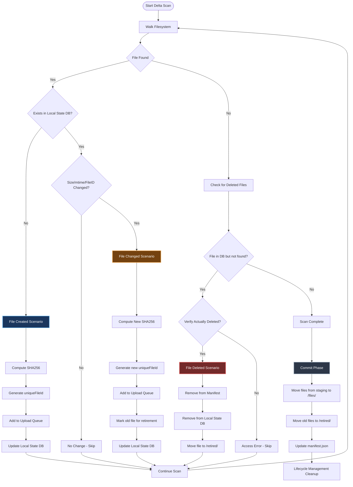

# Cloud Backup API - Technical Design

## 1) Goals & Non-Goals

**Goals**
- Ultra-low cost cloud backup (~€2/TB/month when data is rarely read) by pushing bulk data straight to Azure Blob with minimal control-plane calls.
- Zero exposure of account keys; clients get **time-boxed, least-privilege** write access only via SAS URLs.
- **Incremental multi-file sync** (upload only new/changed files).
- Leverage existing .NET Azure Container Apps infrastructure with Terraform IaC and GitHub Actions CI/CD.

**Non-Goals**
- Full enterprise backup feature set (PST/VHD consistent snapshots via VSS, cross-platform Linux/macOS, etc.).
- Rich restore UX; a minimal "download latest" flow is sufficient for v1.
- Complex orchestration; keep the API surface minimal and stateless.

**Assumptions**
- All clients are Windows.
- Azure Subscription available with: Azure Container Apps, Azure Blob Storage (GPv2), Microsoft Entra ID.
- Encryption is applied client-side before/while uploading.
- Existing Terraform infrastructure can be extended for backup-specific resources.

---

## 2) Architecture Overview



Key ideas:
- The **Windows client** authenticates to Azure Container App via Entra ID (MSAL).
- Azure Container App uses its **Managed Identity** + **Storage Blob Delegator** role to mint **User Delegation SAS** (UD-SAS).
- The client uploads **directly to Blob** using a short-lived SAS with narrow scope (write/create only), minimizing Container App traffic and costs.

---

## 3) Storage Layout & Naming

Per device namespace under a single container (example: `backups`):

```
/devices/{deviceId}/
  manifest.json                          # current file list + metadata
  files/{uniqueFileId}                   # uploaded files with unique names
  staging/...                            # temp area for in-progress uploads
  retired/{uniqueFileId}                 # files marked for deletion
```

**IDs**
- `deviceId`: deterministic (e.g., stable GUID per PC).
- `uniqueFileId`: SHA-256 hash + timestamp + random suffix; e.g., `abc123def...789_2025-09-16T14-30-15Z_k8p3m`.

**File Versioning**
- Each file version gets a **unique blob name** based on content hash + timestamp.
- `manifest.json` maps logical file paths to current `uniqueFileId`.
- Updated files get new `uniqueFileId`, old files moved to `/retired/` path for lifecycle cleanup.
- Single backup per device - no snapshot history retained.

**Tiering**
- Choose **Cool/Cold** for frequent churn (30/90 day minimum retention).
- Choose **Archive** only for rare rotations (180 day minimum).
- Configured via Terraform lifecycle management policies on `/retired/` prefix.

---

## 4) Data Flows (Sequence)

### 4.1 Single backup sync with unique file naming



> **HNS ON** enables directory-scoped SAS (`sr=d`). If HNS is **OFF**, fall back to minting **per-blob** SAS URLs in batches.

### 4.2 File Operation Scenarios



#### 4.2.1 File Created

**Detection:**
- **Local state DB** comparison: New file appears in filesystem walk that wasn't present in previous scan.
- File has no entry in the local state database (`relativePath` not found).

**Process:**
1. File discovered during delta scan with ignore rules applied.
2. Compute `sha256` hash and collect metadata (`length`, `lastWriteUtc`, optional NTFS File ID).
3. Generate `uniqueFileId`: `{sha256}_{timestamp}_{random}` (e.g., `abc123...789_2025-09-17T10-30-00Z_k8p3m`).
4. Upload to staging area: `staging/{uniqueFileId}`.
5. During commit phase: move to `/devices/{deviceId}/files/{uniqueFileId}`.
6. Update `manifest.json` with mapping: `{"relativePath": "documents/file.txt", "uniqueFileId": "abc123...k8p3m", "size": 1024, "lastModified": "2025-09-17T10:30:00Z"}`.
7. Update local state DB with new entry after successful commit.

#### 4.2.2 File Changed

**Detection:**
- **Size + mtime check**: File exists in local state DB but `(length, lastWriteUtc)` differs from stored values.
- **Hash verification**: If size/mtime match but optional `sha256` differs (for paranoid mode).
- **NTFS File ID change**: File ID (FRN) differs, indicating file was replaced.

**Process:**
1. Detected file is added to upload queue.
2. Compute new `sha256` hash and update metadata.
3. Generate new `uniqueFileId`: `{newSha256}_{timestamp}_{random}`.
4. Upload new version to staging: `staging/{newUniqueFileId}`.
5. **Old file retirement**: During commit phase:
   - Move old file from `/devices/{deviceId}/files/{oldUniqueFileId}` to `/devices/{deviceId}/retired/{oldUniqueFileId}`.
   - Move new file from staging to `/devices/{deviceId}/files/{newUniqueFileId}`.
   - Update `manifest.json` with new mapping: `{"relativePath": "documents/file.txt", "uniqueFileId": "newUniqueFileId", ...}`.
6. Update local state DB with new metadata after successful commit.
7. Lifecycle management cleans up files in `/retired/` after retention period.

#### 4.2.3 File Deleted

**Detection:**
- **Absence detection**: File exists in local state DB but is not found during current filesystem walk.
- File entry exists from previous scan but `relativePath` is no longer accessible or doesn't exist.

**Process:**
1. During delta scan, track all files seen in current run.
2. Compare with previous local state DB entries - missing files are candidates for deletion.
3. Verify deletion (not just inaccessible due to permissions/errors):
   - Attempt `File.Exists()` check.
   - Parent directory still exists and is accessible.
4. **Marking for removal**:
   - Remove entry from `manifest.json` for the deleted file path.
   - Remove from local state DB.
5. During commit phase:
   - Move file from `/devices/{deviceId}/files/{uniqueFileId}` to `/devices/{deviceId}/retired/{uniqueFileId}`.
   - Update `manifest.json` without the deleted file entry.
6. Lifecycle management handles cleanup of files in `/retired/` after retention period.

**Note**: Actual blob deletion is deferred to lifecycle management policies to avoid early deletion fees and provide recovery opportunities.

---

## 5) Security Model

- **No account keys** on clients.
- Clients receive **short-lived UD-SAS** with:
  - `sp=w` (+`c` for create operations), **no read/list/delete**.
  - Scope: specific directory for multi-file uploads (HNS ON required).
  - `spr=https` only; optional `sip` (client IP) restriction.
  - Expiry: 15–60 minutes typical.
- Azure Container App authenticates via Entra (App Registration) and uses its **Managed Identity** for storage actions.
- Optional: **Blob index tags** (e.g., `state=retired`) to drive lifecycle cleanup policies.

---

## 9) Windows Client Design

### 9.1 Delta Scanner (drive-level)
- Maintain a **local state DB** (JSON or SQLite) with: `relativePath`, `length`, `lastWriteUtc`, optional `sha256`, optional NTFS **File ID** (FRN).
- One pass per run:
  - Compile ignore rules; walk with `EnumerationOptions` (ignore inaccessible; skip reparse points).
  - Shortlist changes via `(size, mtime)`; compute `sha256` only for candidates.
  - Deletions = previous entries not seen this run.
- **Blacklist rules** via a `.backupignore` file (gitignore-style) per device/drive.

Example `.backupignore`:
```
# system dirs
$RECYCLE.BIN/
System Volume Information/
Windows/
Program Files*/

# patterns
**/*.tmp
**/*.log
**/*.bak
**/~$*.doc*
**/node_modules/
**/.git/
```

### 9.2 Uploader
- Large **Block Blob** uploads with parallel `Put Block` + `Put Block List`.
- Block size 128–256 MiB typical; tune threads by CPU/IOPS.
- **Unique File Naming**: Generate `uniqueFileId` as `{sha256}_{timestamp}_{random}` before upload.
- Headers:
  - `x-ms-blob-type: BlockBlob`
  - `x-ms-access-tier: Cold|Cool|Archive` (set at upload time)
  - `If-None-Match: *` (create-only)
- Integrity:
  - Rolling **MD5/CRC64** and/or **SHA-256** per file; send in `/commit-*` for server validation.
- Resume:
  - Re-stage missing blocks and re-commit if interrupted (idempotent on `uniqueFileId + block IDs`).
- **File Mapping**: Maintain mapping from `relativePath` to `uniqueFileId` for commit phase.

---

## 10) Cost Management & Retention

### 10.1 Storage Tier Strategy & 30-Day Rule

**Initial Upload Tier: Cold Storage**
- All files uploaded initially to **Cold tier** (90-day minimum retention).
- Provides good balance: cheaper than Cool, but accessible for potential early changes/corrections.
- Cost: ~€0.0152/GB/month vs Cool (€0.018/GB/month).

**30-Day Promotion to Archive**
- After 30 days, **Lifecycle Management** automatically promotes blobs from Cold → **Archive tier**.
- Archive tier: ~€0.00099/GB/month (cheapest long-term storage).
- 180-day minimum retention in Archive, but files are rarely accessed after 30 days.

**Early Retention Fee Avoidance**
- **File moves** (`/files/` → `/retired/`) are **rename operations** - **NO early deletion fees**.
- Only actual **deletion** of blobs triggers early retention penalties.
- Strategy: Files stay in their current tier when moved to `/retired/`, lifecycle rules handle final cleanup.

### 10.2 Lifecycle Management Rules

```terraform
# Terraform lifecycle management policy example
resource "azurerm_storage_management_policy" "backup_lifecycle" {
  storage_account_id = azurerm_storage_account.backup.id

  rule {
    name    = "backup-tier-promotion"
    enabled = true
    
    filters {
      prefix_match = ["devices/"]
      blob_types   = ["blockBlob"]
    }
    
    actions {
      base_blob {
        # Promote to Archive after 30 days
        tier_to_archive_after_days_since_creation = 30
        # Delete from /retired/ after minimum retention + grace period
        delete_after_days_since_creation = 210  # 180 (archive min) + 30 (grace)
      }
    }
  }
  
  rule {
    name    = "retired-cleanup"
    enabled = true
    
    filters {
      prefix_match = ["devices/*/retired/"]
      blob_types   = ["blockBlob"]
    }
    
    actions {
      base_blob {
        # Delete retired files after minimum retention period
        delete_after_days_since_creation = 210
      }
    }
  }
}
```

### 10.3 Cost Optimization Benefits

- **Minimum retention**: Cold (90 d), Archive (180 d). Early deletion fees apply only for actual blob deletion.
- To **avoid penalties** while rotating frequently:
  - Always upload to **new unique names** (`uniqueFileId` format).
  - Move previous files to `/retired/` directory (no fees for moves).
  - Use **Lifecycle Management** to delete after tier minimum retention periods.
- **Container App costs**: Pay-per-use model keeps costs minimal for infrequent backup operations.

### Example Cost Estimate (1TB/month)
- **Storage**: 
  - Month 1-30: €15.20/TB (Cold tier)
  - Month 30+: €0.99/TB (Archive tier)
  - Blended annual average: ~€2-3/TB/month
- **Transactions**: ~€0.10/month (assuming 10k operations)
- **Container App execution**: ~€0.10/month (minimal compute time and scaling)
- **Egress**: €0 (uploads are ingress; downloads charged separately)
- **Early deletion fees**: €0 (avoided through move operations + lifecycle timing)

---

## 11) Reliability, Idempotency & Retries

- **Idempotent commits**: `/commit-*` uses file mappings (`relativePath` -> `uniqueFileId`); replays are safe.
- **Manifest updates** protected by ETag/lease; retries with backoff.
- **Exponential backoff + jitter** for network/storage retries.
- **Checksums** verified server-side before publishing.
- **Partial uploads** never become current; old manifest remains valid until successful commit.
- **Container App reliability**: Stateless design; all state in blob storage manifest.

---

## 12) Observability

- **Client metrics**: files scanned/changed, bytes uploaded, throughput, duration, failures.
- **Container App logs**: request IDs, mint/commit events, validation failures, pointer updates.
- **Storage metrics**: egress/ingress, transactions, capacity by tier.
- **Application Insights**: End-to-end tracing with correlation IDs.
- Add **correlation IDs** (deviceId + snapshotId) across client/Container App/logs.

---

## 13) Success Metrics

- **Cost efficiency**: Stay under €3/TB/month all-in cost.
- **Reliability**: 99.9% successful backup completion rate.
- **Performance**: Complete 100GB backup in under 2 hours on typical home broadband.
- **Security**: Zero account key exposures, all access via time-limited SAS.
- **Usability**: One-click backup initiation, automated scheduling.
