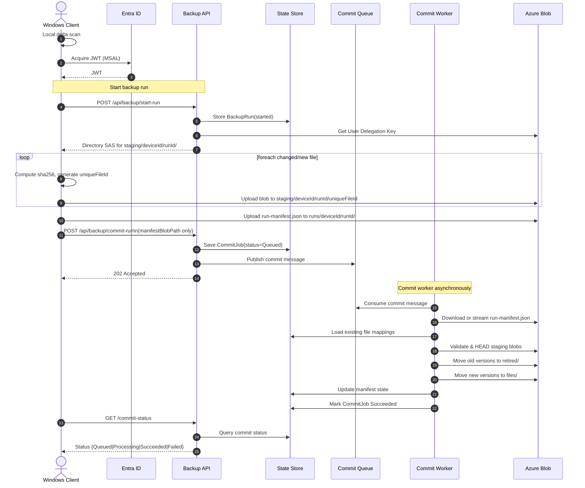
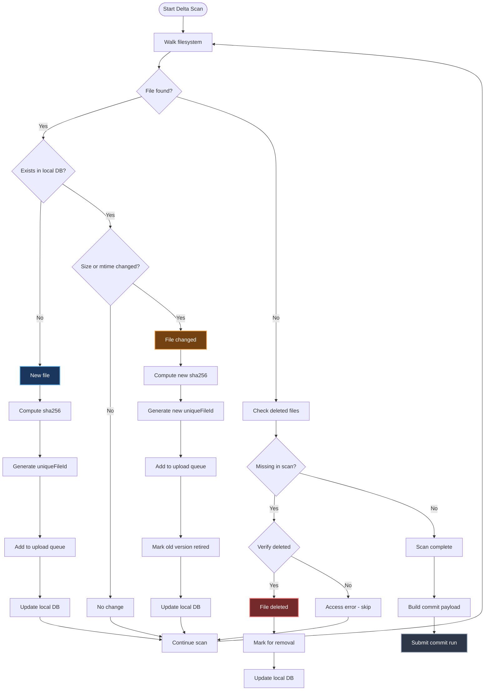

Here’s the updated design with the “sweet spot” iteration baked in:

* **Directory-scoped SAS to staging per run**
* **Async commit worker**
* **Manifest/state in Azure Table Storage via Dapr**
* **ACA + Dapr sidecar**

---

# Cloud Backup API - Technical Design (v2 – Sweet Spot + Dapr + Table Storage)

## 1) Goals & Non-Goals

**Goals**

* Ultra-low cost cloud backup (~€2/TB/month when data is rarely read) by pushing bulk data straight to Azure Blob with minimal control-plane calls.
* Zero exposure of account keys; clients get **time-boxed, least-privilege** write access only via SAS URLs.
* **Incremental multi-file sync** (upload only new/changed files).
* Leverage existing .NET Azure Container Apps infrastructure with Terraform IaC and GitHub Actions CI/CD.
* Centralize **backup manifest/state in a cloud state store** (Azure Table Storage via Dapr) for consistency, restore, and observability.

**Non-Goals**

* Full enterprise backup feature set (PST/VHD consistent snapshots via VSS, cross-platform Linux/macOS, etc.).
* Rich restore UX; a minimal "download latest" flow is sufficient for v1.
* Complex orchestration; keep the API surface minimal and hide storage/state complexity behind Dapr building blocks.

**Assumptions**

* All clients are Windows.
* Azure Subscription available with: Azure Container Apps, Azure Blob Storage (GPv2 with HNS ON), Microsoft Entra ID, Azure Table Storage.
* Encryption is applied client-side before/while uploading.
* Existing Terraform infrastructure can be extended for backup-specific resources.
* Dapr sidecars are enabled for all Container Apps to abstract state and messaging.

---

## 2) Architecture Overview

```mermaid
flowchart TD
    Client[Windows Client]
    EntraID[Entra ID]

    API[Backup API\nACA + Dapr]
    State[State Store\nAzure Table Storage]
    Queue[Commit Queue\nPubSub]
    Worker[Commit Worker\nACA Job]

    Blob[Azure Blob Storage\nADLS Gen2]

    %% Auth
    Client -->|1 Auth via MSAL| EntraID
    EntraID -->|2 JWT Token| Client

    %% Start-Run
    Client -->|3 Start Run| API
    API -->|4 State ops via Dapr| State

    %% Upload Path
    API -->|5 Dir SAS for staging| Client
    Client -->|6 File uploads to staging| Blob
    Client -->|7 Upload run-manifest.json| Blob

    %% Commit
    Client -->|8 Commit-Run\n(manifest path only)| API
    API -->|9 Publish commit job| Queue

    %% Worker
    Worker -->|10 Load manifest.json| Blob
    Worker -->|11 Verify and move blobs| Blob
    Worker -->|12 Update manifest state| State

    style Client fill:#1a365d,color:#fff
    style EntraID fill:#553c9a,color:#fff
    style API fill:#1a5f3f,color:#fff
    style Worker fill:#22543d,color:#fff
    style Blob fill:#c53030,color:#fff
    style State fill:#744210,color:#fff
    style Queue fill:#2d3748,color:#fff

```

Key ideas:

* The **Windows client** authenticates to the Backup API (Azure Container App) via Entra ID (MSAL).
* The Backup API uses its **Managed Identity** + **Storage Blob Delegator** role to mint **User Delegation SAS** (UD-SAS) for a **staging directory** per backup run.
* The client uploads **directly to Blob** using a short-lived directory-scoped SAS (write/create only), minimizing Container App traffic and costs.
* The API and commit worker use **Dapr state store** (backed by Azure Table Storage) as the **authoritative manifest/state**.
* A background **commit worker** (ACA Job or separate Container App) processes commit jobs asynchronously: verifies staged blobs, moves them to `files/`, retires old versions, and updates manifest state.

---

## 3) Storage Layout & Naming

Single storage account + container (example: `backups`) with the following layout:

```text
/backups/
  devices/{deviceId}/
    files/{uniqueFileId}           # immutable active file versions
    retired/{uniqueFileId}         # retired versions pending lifecycle cleanup

  staging/{deviceId}/{runId}/
    {uniqueFileId}                 # temporary upload locations

  runs/{deviceId}/{runId}/
    run-manifest.json              # list of new/changed/deleted files for this run
```

**IDs**

* `deviceId`: deterministic (e.g., stable GUID per PC).
* `runId`: unique per backup run (`yyyyMMddTHHmmssZ` + random or GUID).
* `uniqueFileId`: SHA-256 hash + timestamp + random suffix; e.g.
  `abc123def...789_2025-09-16T14-30-15Z_k8p3m`.

### Purpose of `/runs/`:

* Allows arbitrarily large lists of file changes
* Avoids oversized HTTP payloads
* Enables streaming & partial commit processing
* Persistent record for debugging & audit

**File Versioning**

* Each file version gets a **unique blob name** under `/devices/{deviceId}/files/{uniqueFileId}`.
* The **authoritative mapping** from `relativePath` → `uniqueFileId` lives in the **state store** (Azure Table Storage via Dapr), not in a blob `manifest.json`.
* Updated files get new `uniqueFileId`; previous versions are marked `Retired` and their blobs moved to `/devices/{deviceId}/retired/{uniqueFileId}`.
* v1 keeps only the latest active version per path; older ones are retained only as retired blobs for retention (no rich snapshot history).

**Tiering**

* Choose **Cold** for initial uploads (90-day minimum retention).
* After 30 days, lifecycle policies promote to **Archive** for long-term storage (180-day minimum).
* Tiering and deletion are driven by **Blob lifecycle management** based on prefixes and/or tags (e.g., `state=retired`).

---

## 4) Data Flows (Sequence)

### 4.1 Single backup run with directory-scoped SAS and async commit



> The commit endpoint is **asynchronous**: it enqueues a commit job and returns `202 Accepted` quickly to avoid long-running HTTP timeouts. Heavy work happens in the commit worker.

> **HNS ON** enables directory-scoped SAS (`sr=d`) for `staging/{deviceId}/{runId}/`. This avoids per-file SAS overhead and keeps control-plane calls minimal.

---

### 4.2 File Operation Scenarios (client-side delta logic)

The client-side delta logic remains largely the same; what changes is **how** changes are reported (via `/start-run` + `/commit-run`) and how the server commits them (via manifest state + async worker).



#### 4.2.1 File Created

**Detection:**

* **Local state DB** comparison: new file appears in filesystem walk that wasn’t present in the previous scan.

**Process:**

1. File discovered during delta scan with ignore rules applied.

2. Compute `sha256` hash and collect metadata (`length`, `lastWriteUtc`, optional NTFS File ID).

3. Generate `uniqueFileId`: `{sha256}_{timestamp}_{random}`.

4. Add to **upload queue** and **local mapping**: `relativePath → uniqueFileId`.

5. Upload to staging area during this run:
   `staging/{deviceId}/{runId}/{uniqueFileId}` (using directory SAS).

6. Include in `/commit-run` payload as:

   ```json
   {
     "relativePath": "documents/file.txt",
     "uniqueFileId": "abc123...k8p3m",
     "size": 1024,
     "lastModified": "2025-09-17T10:30:00Z",
     "sha256": "..."
   }
   ```

7. Server (commit worker) moves blob to `/devices/{deviceId}/files/{uniqueFileId}` and updates manifest state in Table Storage.

#### 4.2.2 File Changed

**Detection:**

* **Size + mtime check**: file exists in local state DB but `(length, lastWriteUtc)` differs.
* Optional **hash verification** for paranoid mode.
* Optional **NTFS File ID** change indicating replacement.

**Process:**

1. Detected changed file is added to upload queue.
2. Compute new `sha256` hash and metadata.
3. Generate new `uniqueFileId`.
4. Upload new version to staging: `staging/{deviceId}/{runId}/{newUniqueFileId}`.
5. Mark old version in local state as “retired candidate”.
6. Include in `/commit-run` payload as a `newFile` entry; server:

   * Moves staged blob → `/devices/{deviceId}/files/{newUniqueFileId}`.
   * Marks old version as retired in Table Storage.
   * Moves old blob → `/devices/{deviceId}/retired/{oldUniqueFileId}`.
7. Lifecycle management eventually deletes retired blobs per retention policy.

#### 4.2.3 File Deleted

**Detection:**

* File exists in local state DB but is not found in current filesystem walk.
* After verification attempts (permissions, transient errors), marked as deleted.

**Process:**

1. Track all files seen this run; previous entries not seen become deletion candidates.
2. Verify deletion with `File.Exists()` and directory checks.
3. Add `relativePath` to `deletedFiles[]` in `/commit-run` payload.
4. Update local state DB to remove the file.
5. Commit worker:

   * Removes mapping from `Files` table (or marks as deleted).
   * Marks corresponding FileVersion as retired.
   * Moves blob `/devices/{deviceId}/files/{uniqueFileId}` → `/devices/{deviceId}/retired/{uniqueFileId}`.
6. Lifecycle management handles eventual deletion from Archive/Cold tier.

> Note: actual blob deletion is deferred to lifecycle policies to avoid early deletion fees and to provide recovery opportunities.

---

## 5) Security Model

* **No account keys** on clients.
* Clients receive **short-lived UD-SAS** for:

  * Scope: `staging/{deviceId}/{runId}/` (directory-scoped, HNS ON).
  * Permissions: `sp=c` (create-only) or `sp=wc` (write+create) as needed, **no read/list/delete**.
  * `spr=https` only; optional `sip` restriction to client IP / CIDR.
  * Expiry: typically 15–60 minutes per run.
* Backup API authenticates via Entra ID and uses its **Managed Identity** to:

  * Get User Delegation Keys from Blob storage.
  * Perform blob rename/move operations (`staging` → `files`, `files` → `retired`).
* **Blob Storage public access disabled**; all access via SAS or Managed Identity from trusted services.
* **State Store (Azure Table Storage)** is accessed only from Container Apps via:

  * Dapr state-store component configuration.
  * Azure Storage connection string / identity stored in Key Vault or ACA secrets.
* Multi-tenant / multi-device isolation:

  * `deviceId` is bound to the authenticated user/tenant in the API.
  * SAS scope includes `deviceId` + `runId`, ensuring a client cannot write outside its staging area.
* Optional: **Blob index tags** (e.g., `state=retired`, `deviceId={deviceId}`) to refine lifecycle policies.

---

## 6) State & Manifest Model (Azure Table Storage via Dapr)

The manifest/state is no longer kept in a blob `manifest.json`; instead it resides in Azure Table Storage behind a Dapr state store:

### Logical entities

> Exact physical schema can be backed by Azure Table Storage (v1) and later migrated to Cosmos DB Table API with minimal changes.

**Files (latest mapping per path)**

* Key: `(deviceId, relativePath)` (or hashed path).
* Fields:

  * `deviceId`
  * `relativePath`
  * `currentVersionId` (uniqueFileId)
  * `size`
  * `lastWriteUtc`
  * `lastBackupRunId`
  * `isDeleted` (bool)

**FileVersions (all versions per device/path)**

* Key: `(deviceId, uniqueFileId)`
* Fields:

  * `deviceId`
  * `uniqueFileId`
  * `relativePath`
  * `sha256`
  * `size`
  * `createdAt`
  * `retiredAt` (nullable)
  * `state` = Active | Retired

**BackupRuns**

* Key: `(deviceId, runId)`
* Fields:

  * `deviceId`
  * `runId`
  * `startedAt`
  * `completedAt`
  * `status` = Queued | Processing | Succeeded | Failed
  * `stats` (files scanned, changed, deleted, bytes uploaded)

**CommitJobs**

* Key: `commitId`
* Fields:

  * `commitId`
  * `deviceId`
  * `runId`
  * `status` = Queued | Processing | Succeeded | Failed
  * `error` (nullable)
  * `createdAt`, `updatedAt`

All CRUD against these entities goes through **Dapr state store APIs** from API and worker.

---

## 7) Async Commit & Background Processing

To avoid long-running HTTP calls and timeouts:

* `/api/backup/commit-run` is **async**:

  * Validates payload shape quickly.
  * Saves a `CommitJob` with `status=Queued`.
  * Publishes a commit message via Dapr Pub/Sub / Queue.
  * Responds `202 Accepted { commitId }`.

* A **Commit Worker** (ACA Job or separate Container App) subscribes to commit messages:

  * Loads `CommitJob`, `BackupRun`, and file lists from the state store.
  * Verifies staged blobs with HEAD requests (size/hash).
  * Renames blobs:

    * `staging/{deviceId}/{runId}/{uniqueFileId}` → `/devices/{deviceId}/files/{uniqueFileId}`
    * Previous active versions → `/devices/{deviceId}/retired/{oldUniqueFileId}`
  * Updates `Files` and `FileVersions` state in a consistent way (using batches).
  * Updates `CommitJob.status` and `BackupRun.status` to `Succeeded` or `Failed`.

* Client polls `GET /api/backup/commit-status?commitId=...`:

  * API reads `CommitJob` via Dapr and returns current status.

This model:

* Prevents HTTP timeouts.
* Allows retries and robust error handling inside the commit worker.
* Keeps the API stateless and fast.

---

## 8) Dapr Integration

Dapr is used to abstract infrastructure concerns:

* **State Store (`manifestStore`)**:

  * Backed by Azure Table Storage for v1.
  * Future: switch to Cosmos DB Table API or SQL-based state store by changing Dapr component config, not app code.

* **Pub/Sub / Queue**:

  * Used for commit job dispatch from API to worker.
  * Backed by Azure Storage Queue / Service Bus / other.

* **Output bindings (optional)**:

  * For writing logs or manifest snapshots to Blob if needed.

Application code:

* Talks to `daprClient.SaveStateAsync()` / `GetStateAsync()` / `QueryStateAsync()`.
* Talks to `daprClient.PublishEventAsync()` for commit jobs.

Backend changes (Table → Cosmos, Queue type, etc.) are handled by **Dapr component YAML**, keeping the design future-proof.

---

## 9) Windows Client Design

### 9.1 Delta Scanner (drive-level)

* Maintain a **local state DB** (JSON or SQLite) with:
  `relativePath`, `length`, `lastWriteUtc`, optional `sha256`, optional NTFS **File ID** (FRN).
* One pass per run:

  * Compile ignore rules; walk with `EnumerationOptions` (ignore inaccessible; skip reparse points).
  * Shortlist changes via `(size, mtime)`; compute `sha256` only for candidates.
  * Deletions = previous entries not seen this run.
* **Blacklist rules** via a `.backupignore` file (gitignore-style) per device/drive.

Example `.backupignore`:

```text
# system dirs
$RECYCLE.BIN/
System Volume Information/
Windows/
Program Files*/

# patterns
**/*.tmp
**/*.log
**/*.bak
**/~$*.doc*
**/node_modules/
**/.git/
```

### 9.2 Uploader

* Large **Block Blob** uploads with parallel `Put Block` + `Put Block List`.

* Block size 128–256 MiB typical; tune threads by CPU/IOPS.

* **Unique File Naming**: generate `uniqueFileId` as `{sha256}_{timestamp}_{random}` before upload.

* Obtain **directory-scoped SAS** for `staging/{deviceId}/{runId}/` via `/start-run`.

* Upload each changed/new file as:

  `staging/{deviceId}/{runId}/{uniqueFileId}`

* Headers:

  * `x-ms-blob-type: BlockBlob`
  * `x-ms-access-tier: Cold|Cool|Archive` (set at upload time, typically Cold for v1).
  * `If-None-Match: *` (create-only).

* Integrity:

  * Rolling **MD5/CRC64** and/or **SHA-256** per file; send in `/commit-run` payload for server-side verification.

* Resume:

  * Re-stage missing blocks and re-commit if interrupted (idempotent on `uniqueFileId + block IDs`).
  * If entire run is interrupted, client can either:

    * Retry that run (reuse `runId` if safe), or
    * Start a new run and let server clean up stale `Pending` items.

* **File Mapping**:

  * Maintain a mapping `relativePath → uniqueFileId` for this run.
  * This mapping is sent to the server in `/commit-run` and used server-side to update manifest state.

### After uploading all file blobs, create and upload:

```
runs/deviceId/runId/run-manifest.json
```

### Contents:

```json
{
  "deviceId": "...",
  "runId": "...",
  "files": [
    {
      "relativePath": "...",
      "uniqueFileId": "...",
      "sha256": "...",
      "size": 1234,
      "mtime": "..."
    }
  ],
  "deleted": [
    "a/b/c.txt",
    "x/y/z.jpg"
  ]
}
```

---

## 10) Cost Management & Retention

### 10.1 Storage Tier Strategy & 30-Day Rule

**Initial Upload Tier: Cold Storage**

* All files uploaded initially to **Cold tier** (90-day minimum retention).
* Good balance: cheaper than Cool, still accessible for early corrections.
* Cost: ~€0.0152/GB/month vs Cool (€0.018/GB/month).

**30-Day Promotion to Archive**

* Lifecycle Management automatically promotes Cold → **Archive** after 30 days.
* Archive tier: ~€0.00099/GB/month.
* 180-day minimum retention in Archive; files are assumed to be rarely accessed after 30 days.

**Early Retention Fee Avoidance**

* File moves (`staging` → `files` → `retired`) are **rename operations** with HNS ON (ADLS Gen2) – **no early deletion fees**.
* Only actual **deletion** of blobs triggers early retention penalties.
* Strategy:

  * Always upload to **new unique names** (`uniqueFileId`).
  * Move previous files to `/retired/` directory (no fees for moves).
  * Use Lifecycle Management to delete retired blobs after tier minimum retention.

### 10.2 Lifecycle Management Rules

*(unchanged conceptually, updated to reflect manifest-in-state-store)*

```terraform
resource "azurerm_storage_management_policy" "backup_lifecycle" {
  storage_account_id = azurerm_storage_account.backup.id

  rule {
    name    = "backup-tier-promotion"
    enabled = true

    filters {
      prefix_match = ["devices/"]
      blob_types   = ["blockBlob"]
    }

    actions {
      base_blob {
        tier_to_archive_after_days_since_creation = 30
        delete_after_days_since_creation          = 210  # 180 (archive min) + 30 (grace)
      }
    }
  }

  rule {
    name    = "retired-cleanup"
    enabled = true

    filters {
      prefix_match = ["devices/*/retired/"]
      blob_types   = ["blockBlob"]
    }

    actions {
      base_blob {
        delete_after_days_since_creation = 210
      }
    }
  }
}
```

### 10.3 Cost Optimization Benefits

* **Minimum retention**: Cold (90 d), Archive (180 d). Early deletion fees only on actual deletions.
* To **avoid penalties** while rotating frequently:

  * Always write new versions as new blobs (never overwrite).
  * Retire old versions by moving to `/retired/` and letting lifecycle rules handle deletion.
* **Container App + Dapr + worker costs** are kept low:

  * API is mostly control-plane (small JSON).
  * Data plane is direct client → Blob.
  * Commit workers run only when needed (per commit job).
* **State store (Azure Table Storage)** is extremely low-cost for v1 (few devices, <1M files).

---

## 11) Reliability, Idempotency & Retries

* **Idempotent runs & commits**:

  * `runId` uniquely identifies a backup run.
  * `commitId` uniquely identifies a commit job.
  * Replays of `/commit-run` with the same `runId` are either deduplicated or mapped to the existing `CommitJob`.
* **Asynchronous commit** ensures:

  * No long-lived HTTP requests.
  * Heavy blob and state operations happen off the request path.
* **State updates**:

  * Dapr state store operations are retried with backoff.
  * Updates to Files/FileVersions are applied in consistent batches.
* **Partial uploads**:

  * Staged blobs that never get committed remain unused; background cleanup can remove stale staging blobs older than a threshold.
  * Active manifest state is only updated after blobs are verified and moved.
* **Retries**:

  * Client-side: exponential backoff + jitter for network/storage errors.
  * Worker: per-commit job retries on transient storage or state store failures.
* **Container App reliability**:

  * API remains stateless (externalized state & queue).
  * Commit worker can be scaled independently based on queue length.

---

## 12) Observability

* **Client metrics**:

  * Files scanned/changed/deleted.
  * Bytes uploaded.
  * Throughput, duration, failures.
* **Backup API logs**:

  * Request IDs.
  * `start-run`, `commit-run`, `commit-status` calls.
  * SAS minting events (deviceId, runId).
  * Commit job enqueue operations.
* **Commit worker logs**:

  * Commit job lifecycle (Queued → Processing → Succeeded/Failed).
  * Counts of files verified/moved/retired per job.
  * Blob and state-store failures with retry attempts.
* **Storage metrics**:

  * Egress/ingress, transactions, capacity by tier.
* **State store metrics**:

  * Request counts, latency, throttling (if any).
* **Application Insights**:

  * End-to-end tracing with correlation IDs:

    * `deviceId`
    * `runId`
    * `commitId`
* Correlated logs across:

  * Client (runId).
  * API (runId, commitId).
  * Worker (commitId).

---

## 13) Success Metrics

* **Cost efficiency**:

  * Stay under €3/TB/month all-in storage cost.
  * Keep control-plane (API + state store + worker) under a few euros per month for home-scale v1.
* **Reliability**:

  * 99.9% successful backup completion rate.
  * No data loss for committed runs.
* **Performance**:

  * Complete 100GB backup in under 2 hours on typical home broadband (upload path remains client → Blob).
  * Commit latency acceptable (async; typically minutes or less).
* **Security**:

  * Zero account key exposures.
  * Blob and state store accessible only via time-limited SAS or Managed Identity from trusted services.
* **Usability**:

  * One-click backup initiation, automated scheduling.
  * Clear status for each run (In progress, Succeeded, Failed) via `/commit-status`.