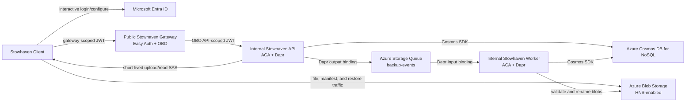

# Stowhaven Technical Design

This document describes the architecture implemented in this repository. It is intended to explain the current system, not a future design.

## Naming and compatibility

**Stowhaven** is the product and repository brand. Several older implementation identifiers deliberately remain unchanged because they are configuration contracts or deployment identities: the `FlorisDeV.Backup*` solution, assemblies, and namespaces; the `BackupApiClient` configuration section; the Dapr app ID and image suffix `backup-api`; and the `backup-client` executable link, data directory, and systemd unit names. Existing Azure resource names and Entra application IDs also remain valid.

Changing those identifiers is a separate migration, not a branding change. Keeping them stable avoids breaking upgrades, orphaning client state or token caches, and disconnecting existing cloud resources.

## 1. Goals and boundaries

### Goals

- Keep bulk backup traffic off the application services by uploading and restoring directly through Azure Blob Storage SAS URLs.
- Avoid storage account keys on client machines.
- Upload only new or changed files and report deletions through a run manifest.
- Keep backup commits asynchronous, retryable, and observable.
- Support optional client-side encryption whose recovery material never leaves the client.
- Keep the Azure deployment inexpensive at personal or small-team scale through scale-to-zero Container Apps and storage lifecycle policies.

### Current boundaries

- The client does not create VSS or other filesystem snapshots. Locked files are skipped by default; best-effort shared reads are optional.
- There is no graphical restore interface. Restore is a client command driven by configuration.
- The bundled installation paths target Windows and Linux. The client code uses cross-platform .NET APIs, but macOS does not have a bundled installer in this repository.
- The system keeps the latest active version per logical path. Retired blobs are retained temporarily for lifecycle cleanup, not exposed as a rich snapshot-history feature.

## 2. Runtime topology



Production exposes only the Gateway publicly. API and worker ingress are internal to the Container Apps environment. In local Docker Compose, all three services also have loopback-only host ports for debugging.

### Responsibilities

| Component | Responsibility |
| --- | --- |
| Stowhaven Client | Scan targets, apply ignore rules, calculate deltas, optionally encrypt, upload blobs and manifests, poll commits, and restore files. |
| Stowhaven Gateway | Validate the client-facing token through Container Apps Easy Auth, exchange it through the OAuth on-behalf-of flow, and proxy API/Swagger traffic. |
| Stowhaven API | Authorize device ownership, manage runs and commit jobs, issue SAS URLs, dispatch queue messages, expose restore metadata, and provide operational endpoints. |
| Stowhaven Worker | Claim commit jobs, stream manifests, validate staged blobs, update the file catalog, retire replaced files, and publish final status. |
| Blob Storage | Store staged uploads, temporary run manifests, active file versions, and retired versions. |
| Cosmos DB / SQLite | Store device registrations, runs, commit jobs, per-file progress, manifests, and the active file catalog. |

## 3. Public request path and authentication

The production client requests the Gateway's delegated `backup.access` scope. The Gateway validates that token with Easy Auth and exchanges it for the API's `backup.client` scope while preserving the user's tenant and object identifiers. The API accepts delegated `backup.client`/`backup.admin` tokens and the `backup.gateway` application role.

The two delegated scopes pass the global token gate, while `/api/ops/*` has an additional endpoint-level policy requiring the exact `backup.admin` scope. Normal `backup.client` and app-only `backup.gateway` tokens cannot call those operational routes.

The API binds every registered device to the authenticated `(tenantId, userId)` pair. Device-scoped backup and restore operations authorize that ownership before reading state or issuing storage access.

Local development uses `ASPNETCORE_ENVIRONMENT=Development` and the explicit `ALLOW_DEVELOPMENT_ANONYMOUS_AUTHENTICATION=true` Compose setting. The client skips MSAL only when it is running in Development and the configured API URL is local.

See [Authentication](AUTHENTICATION.md) and [App registrations](APP_REGISTRATIONS.md) for setup details.

## 4. Storage layout

Production uses one HNS-enabled StorageV2 account and the `backups` container:

```text
backups/
  staging/{deviceId:N}/{runId:N}/
    {uniqueFileId}

  runs/{deviceId:N}/{runId:N}/
    run-manifest.json

  devices/{deviceId:N}/
    files/{uniqueFileId}
    retired/{uniqueFileId}
```

- `deviceId` and `runId` are GUIDs. Blob paths use their 32-digit `N` representation.
- `logicalPath` is `{targetName}/{relativePath}` and is the stable identity used by the client and file catalog.
- `uniqueFileId` is `{plaintextSha256}_{UTC timestamp}_{random suffix}`. It is an opaque physical blob name and does not expose a local path.
- Uploaded blob metadata includes the hash and size of the exact uploaded bytes. In client-encrypted mode those values describe ciphertext.

The worker attempts to persist the submitted run manifest as state for operational inspection. Once that succeeds, its temporary blob is removed. If a very large manifest cannot be persisted as one Cosmos document, the blob copy is retained so operations can still inspect it.

## 5. State model

Application state is accessed through `IStateDocumentStore`, not through Dapr state-store APIs.

- Development defaults to a shared SQLite database used by the separate API and worker processes.
- Production uses `CosmosStateDocumentStore` with `DefaultAzureCredential`.
- The Bicep deployment references an existing Cosmos DB account and creates the shared-throughput `backup-state` database plus `manifest-state` and `device-registry` containers.
- Optimistic concurrency uses ETags in both providers.
- Cosmos continuation tokens are returned unchanged; SQLite uses opaque base64-encoded offsets.

The main logical document types are:

- `DeviceRegistration`: ownership, display name, status, and timestamps.
- `BackupRun`: run identity, lifecycle status, completion time, and backed-up file count.
- `CommitJob`: queue/processing state, progress counts, retry metadata, and terminal error details.
- `CommitFileProgress`: deterministic per-file progress through `Pending`, `Moved`, `StateUpdated`, `Succeeded`, or `Failed`.
- `FileEntry`: latest logical-path-to-version mapping.
- `FileVersion`: immutable metadata for an active or retired physical version.
- `RunManifest`: the submitted list of changed files and deleted logical paths when it can be persisted within provider limits.

Run and commit states are `Queued`, `Processing`, `Succeeded`, `CompletedWithErrors`, or `Failed`.

## 6. Messaging and Dapr

Dapr is used for infrastructure integrations that remain outside the state repository:

- `backup-events-output`: Azure Storage Queue output binding scoped to the API.
- `backup-events-input`: Azure Storage Queue input binding scoped to the worker and routed to `POST /api/backupevents/backup-run-committed`.
- `cleanup-staging-cron`: scheduled input binding scoped to the API.
- `secret-store`: local environment secret store in development and Azure Key Vault in production.

The API calls `DaprClient.InvokeBindingAsync(..., "create", event)` to enqueue a commit. The worker processes the queue delivery synchronously so Dapr acknowledges it only after the handler succeeds.

The worker Container App also has an Azure Queue KEDA scale rule with `minReplicas=0`. The Dapr bindings use managed identity in production; the KEDA scaler uses a connection string stored as a Container App secret because that scaler configuration requires one.

## 7. Backup flow

1. The explicit `configure` or `login` command performs interactive MSAL authentication when needed. Normal backup and restore runs use the token cache silently.
2. The client obtains or generates a local device ID and registers it with `POST /api/devices`.
3. The client scans all configured targets. A target-root `.backupignore` replaces the configured global ignore file for that target.
4. The local SQLite catalog uses size and modification time to shortlist changes and computes SHA-256 when content needs analysis.
5. On the first batch that needs upload, the client calls `POST /api/devices/{deviceId}/backup/start-run`.
6. The API creates run state and returns separate 60-minute directory-scoped User Delegation SAS grants for the staging and manifest paths. Local Azurite uses broader container SAS grants because it does not support HNS directory SAS.
7. The client optionally encrypts each changed file, uploads it under its `uniqueFileId`, and records it in a durable pending-run journal.
8. The client refreshes the run's SAS URLs when they may expire before a batch can finish by calling `POST /api/devices/{deviceId}/backup/runs/{runId}/refresh-sas`.
9. The client streams `run-manifest.json` to the run path. The manifest contains changed files and logical paths that disappeared since the previous successful run.
10. The client calls `POST /api/devices/{deviceId}/backup/commit-run`. The API creates or reuses a deterministic commit job, invokes the queue output binding, and returns `202 Accepted`.
11. The worker atomically claims the queued job, streams the manifest, validates each staged blob's length and hash metadata, renames valid blobs into `devices/.../files/`, and retires replaced/deleted versions.
12. The client polls the commit-status endpoint. It updates local file state only after a successful or `CompletedWithErrors` server-side commit.

If polling times out while a durable commit remains queued or processing, the client keeps the pending-run journal. A later invocation resumes status polling instead of starting over. Already staged files in an unfinished run are reused when their path, hash, and size still match.

## 8. Client-side encryption

`BackupClient:Encryption:Mode` supports:

| Mode | Uploaded bytes | Recovery material |
| --- | --- | --- |
| `ServerSideOnly` | Original bytes; Azure Storage still encrypts at rest. | None beyond normal account access. |
| `ClientAndServer` | Client-generated ciphertext. | Recovery phrase file stored only on the client. |

In `ClientAndServer` mode:

- PBKDF2-SHA256 derives a wrapping key from the normalized recovery phrase. The default is 600,000 iterations.
- Each file gets a random encryption key.
- File content uses AES-256-CBC with HMAC-SHA256 over IV and ciphertext.
- The file key is wrapped with AES-256-GCM.
- The manifest contains ciphertext integrity fields and the metadata needed for client-side decryption, including the plaintext SHA-256 and size.

The phrase and unwrapped keys never go to the Gateway, API, worker, or storage account. Losing both the recovery phrase file and the written-down phrase makes encrypted backups unrecoverable.

## 9. Restore flow

1. The client resolves the source device from `BackupClient:Restore:DeviceId` or local device state.
2. If no logical paths are configured, it pages through `GET /api/devices/{deviceId}/restore/files`.
3. It calls `POST /api/devices/{deviceId}/restore/start` with the selected logical paths.
4. The API authorizes ownership and returns a 60-minute read-only directory SAS plus stored metadata for the selected active versions.
5. The client downloads each blob to a temporary file and verifies uploaded size and SHA-256.
6. Encrypted files are authenticated, decrypted with the local recovery phrase, and verified against their plaintext SHA-256 before being moved to the destination.
7. Existing destination files are rejected unless `BackupClient:Restore:OverwriteExisting` is enabled.

Archive-tier blobs must be rehydrated before the read SAS can be used to download them; automatic rehydration is not implemented.

## 10. SAS and storage security

- Production upload and restore tokens are HNS directory-scoped User Delegation SAS grants.
- Upload grants have create/write permissions and no read/list/delete permission.
- Restore grants are read-only.
- Production SAS URLs require HTTPS.
- IP restriction is disabled by default because client public IPs and proxy forwarding can change. It can be enabled with `Backup:Sas:EnableIpRestriction` after trusted proxy settings have been validated.
- Public blob access is disabled.
- API and worker use system-assigned managed identities for Blob/Queue Storage, Cosmos DB, and Key Vault access.
- Storage account keys are not distributed to clients. A Storage connection string is held only as a Container App secret for the worker's KEDA queue scaler.
- Copy/delete fallback for blob moves is disabled by default; production expects HNS rename semantics.

## 11. Reliability and failure handling

- Commit IDs are deterministic for `(deviceId, runId)`, so replaying `commit-run` reuses the same job.
- ETag-based claiming prevents concurrent workers from processing the same queued job.
- Per-file commit progress makes blob moves and state updates resumable after partial failures.
- Staged-content mismatches are recorded as failed files. A run may finish as `CompletedWithErrors` when the percentage remains within the configured worker threshold.
- Client upload retries use Polly v8 exponential backoff with jitter.
- The client has separate upload and commit-status timeouts. A commit-status timeout does not cancel the durable server-side job.
- The API exposes operational endpoints for paged manifests/commits, failed files, commit retry, and staging cleanup.
- Staging cleanup runs both through a Dapr cron binding and through a seven-day Blob lifecycle fallback.

## 12. Lifecycle and cost behavior

The client explicitly assigns the configured staging access tier; the default is `Hot`. Storage lifecycle rules then apply to committed blobs under `backups/devices/`:

- Move to Cold when the lifecycle policy first evaluates the blob (`daysAfterCreationGreaterThan: 0`).
- Move to Archive after `lifecycleArchiveAfterDays`, which defaults to 30.
- Delete blobs tagged `state=retired` after 210 days from creation.
- Delete uncommitted staging blobs after seven days from creation.

Cold and Archive have minimum recommended retention periods and early-deletion charges. Pricing depends on region, redundancy, operations, retrieval, and the customer's offer; do not treat a single per-terabyte figure as a durable system guarantee. Use the [Azure Blob Storage pricing page](https://azure.microsoft.com/pricing/details/storage/blobs/) for current estimates.

## 13. Observability and health

- API, worker, Gateway, and client use structured console/file logging as appropriate.
- API and worker emit OpenTelemetry traces, metrics, and logs to OTLP and/or Azure Monitor when those exporters are configured.
- The client emits the `florisdev.backup.client` activity source and meter.
- Core service instruments use the `florisdev.backup.*` namespace for runs, events, SAS generation, state operations, failures, and duration.
- Correlation middleware enriches server requests and propagates trace context over HTTP.
- Application Insights and Log Analytics are provisioned for production.

The API exposes `GET /api/health`, `/api/health/alive`, `/api/health/ready`, `/health/liveness`, `/health/readiness`, and `/healthz`. The worker exposes `/health/liveness`, `/health/readiness`, and `/healthz`. The Gateway exposes `/healthz`.

## 14. Deployment model

The GitHub Actions workflow:

1. Builds and tests the solution and builds the Gateway separately.
2. Validates both Bicep deployment phases.
3. Deploys foundation resources with `deployContainerApps=false`.
4. Publishes API, worker, and Gateway images to GHCR.
5. Deploys the three Container Apps with the commit SHA image tag.

See [GitHub Actions deployment setup](GITHUB_ACTIONS_DEPLOYMENT.md) for required Azure roles, repository variables, and secrets.
